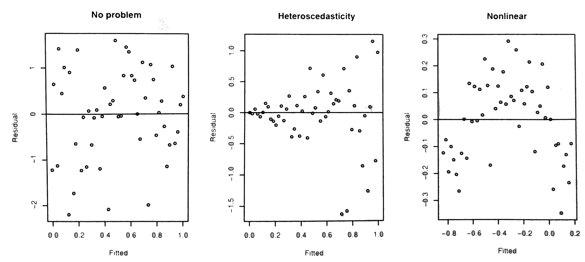

{width="75%"}

```{r setup, include=FALSE, echo=FALSE, message=FALSE, warning=FALSE}
library(learnr)
library(ggplot2)
library(car)
library(shiny)
library(faraway)

knitr::opts_chunk$set(echo = FALSE)
data(gala, package="faraway")
lmod <- lm(Species ~ Area + Elevation + Nearest + Nearest + Scruz + Adjacent, data=gala)
data(fat, package = "faraway")
```

```{r server-setup, context="server"}
# do not use - it interferes with the learnr "Start over" functionality
# session$onSessionEnded(stopApp)
```

## Introduction

<span class="copyright">© Copyright 2021 UNSW Sydney. All rights reserved except where otherwise stated.</span>

This chapter is also closely based on the first set text for the HDAT9600 course: Julian J. Faraway. Linear Models using R. 2nd Edition. CRC Press. This text is referred to as _Faraway LMwR_ in these notes. Although you are encouraged to use this text for additional readings, this is not essential --- these notes have abstracted all the salient points from this text for the material covered by this course.

In this chapter we briefly look at what linear models mean, and the use of linear models to make predictions --- these are both topics which we will return to in Chapter 9 --- and then we take a detailed look at model diagnostics and assumption checking. 

In Chapter 4 we will look at methods for handling categorical predictors, and for dealing with problems we might find with our model and/or violations of its assumptions.

## 1. What does a linear model mean?

Let's consider our model for the Gal&#225;pagos Islands data once again, since we are now quite familiar with it:

```{r model-meaning-set-up, echo=FALSE}
lmod <- lm(Species ~ Area + Elevation + Nearest + Nearest + Scruz + Adjacent, data=gala)
lmod_elev_only <- lm(Species ~ Elevation, data=gala)
```

```{r model-meaning-a, echo=TRUE}
lmod <- lm(Species ~ Area + Elevation + Nearest + Nearest + Scruz + Adjacent, data=gala)
summary(lmod)
```

In this model, what does the fact that the $\beta$ coefficient for `Elevation` is 0.31946 actually mean?

The simple interpretation is as follows: _a unit increase in $x_1$ will produce a change of $\widehat{\beta}_1$ in the outcome $y$_.

Thus, if we compare two islands where the second island has an elevation one metre higher than the first island, then we would expect, according to our model, for there to be 0.32 more species on the second island than the first. Obviously the number of species has to take integer values --- we can't have fractional numbers of species --- but if we said the second island had an elevation that was 100 metres higher than the first island, then we would expect about 32 more species, according to our model.

But what if we consider another model, fitted to the same data, but this time only using the `Elevation` variable as the sole predictor:

```{r model-meaning-b, echo=TRUE}
lmod_elev_only <- lm(Species ~ Elevation, data=gala)
summary(lmod_elev_only)
```

According to this model, we would expect about 20 more species for every 100 metres increase in elevation.

Thus, we cannot interpret the meaning of a regression coefficient for a particular predictor **without** reference to all the other predictors in the model (and to the form of the model).

We can visualise the relationship between `Elevation` and `Species` using an _effect plot_. To construct such a plot, we need to hold the values for all the other predictors constant. Typically we choose the mean or median value for each predictor for this purpose, but that doesn't have to be the case. Let's construct such a plot. Examine the following code to make sure you understand what it is doing before running it:

```{r model-meaning-c, echo=TRUE, exercise=TRUE, exercise.lines=27, exercise.setup="model-meaning-set-up", fig.width=8, fig.height=8, output.width="100%"}
# first create a scatter plot of the data, showing Species versus Elevation
# note the use of the formula interface to the plot() function here
plot(Species ~ Elevation, data=gala)

# now draw a solid line from the Intercept for the Elevation-only model
# using the beta coefficient estimate for Elevation as the slope
abline(coef(lmod_elev_only)[1], coef(lmod_elev_only)[2])

# predict Species using the full model, holding all predictors fixed
# at their mean values, except for Elevation

# first create a suitable data frame
df <- with(gala, data.frame(Area=mean(Area), Elevation=Elevation, 
                            Nearest=mean(Nearest), Scruz=mean(Scruz), 
                            Adjacent=mean(Adjacent)))

# now use it to predict Species using the "full" model
p <- predict(lmod, new=df)

# we need to plot the predicted points in order of ascending Elevation,
# so user order() to create an index vector in the right order
i <- order(df$Elevation)

# use that index vector to plot the points for the full model prediction
# on the plot using a dashed line
lines(df$Elevation[i], p[i], lty=2)
```

Nice! But now we realise that our previous statement about the interpretation of a $\beta$ estimate was somewhat incomplete --- it should have said: _a unit increase in $x_1$ with the other (named) predictors held constant will produce a change of $\widehat{\beta}_1$ in the outcome $y$_.  

Of course, this explanation is somewhat artificial when it comes to real-life observational data, such as in our Gal&#225;pagos Islands dataset. We cannot play the role of some deity and miraculously elevate or depress whole islands, while keeping everything else constant. Such difficulties are even more obvious if you consider, say, a patient dataset to which we fit a model which include (phenotypic) sex as a predictor. How do we interpret the parameter estimate for the sex variable when it must be put in terms such as "the effect of changing the patient's phenotypic sex while keeping all their other characteristics the same"?

We haven't mentioned causal interpretation of our models yet (or the lack thereof). We will touch on that in Chapter 10 of this course.

## 2. Prediction

In the previous chapter we mentioned that regression models have two main uses: prediction and explanation. 

Let's assume that we have used our knowledge (or others' knowledge of the subject matter domain), plus the data we have available, to build a model which we are reasonably happy with --- that is, we think it reasonably captures or characterises the underlying relationships in our observed data, which in turn fairly accurately reflect the underlying processes in whatever system generated the data (where "system" might be anything from a living cell to an entire health care system). Our model takes the form $y = X\beta + \epsilon$.

### Predicted values

Given a new dataset containing the predictor variables we used in our model, and assuming this new dataset was generated by the same underlying biological, economic, sociological, chemical or physical processes that generated the original dataset to which we fitted our model, then we can use our model to make some predictions about value of the outcome variable in our new dataset. Typically we would wish to do that when we have not observed what the actual outcomes in the new dataset actually are, either because they haven't happened yet, or because they cannot easily be determined. So, given a new set of predictor variable data, $X_0$, the predicted response (outcome) is:

$$ \widehat{Y}_0 = X_0\widehat{\beta} $$

<div class="under-the-bonnet">

### Why does that work?

It is worth thinking about this equation for a moment. The result of a matrix multiplication of **A** by **B** is the sum of (each row of **A**  multiplied by each column of **B**). In the equation above, $X_0$ is a matrix of _n_ rows of observations (cases) each with _p_ columns of predictor variables. $\widehat{\beta}$ is a **column-vector** of $\beta$ parameter estimates. Therefore, the first row of the matrix that is the result of  $X_0\widehat{\beta}$ is the sum of: each predictor variable value in the first row of $X_0$ multiplied by the corresponding $\beta$ estimate value in the corresponding row in the only column of $\widehat{\beta}$. Likewise the second row of the matrix that is the result of  $X_0\widehat{\beta}$ is the sum of: each predictor variable value in the second row of $X_0$ multiplied by the corresponding $\beta$ estimate value in the corresponding row in the only column of $\widehat{\beta}$, and so on. This gives us a matrix with a single column of predicted values. Let's examine a concrete example using $\textsf{R}$:

```{r fitted-vals-set-up, echo=FALSE}
X_0 <- matrix(c(1,2,3,4,5,6,7,8), ncol=2, byrow=TRUE)
colnames(X_0) <- c("x1", "x2")
betahat <- matrix(c(20,30), ncol=1)
```

```{r fitted-vals-a, echo=TRUE}
# here is our matrix of new predictor variable values, X_0
# columns are predictor variable x1 and x2
# rows are obseravtions (cases)
X_0 <- matrix(c(1,2,3,4,5,6,7,8), ncol=2, byrow=TRUE)
colnames(X_0) <- c("x1", "x2")
X_0
```

```{r fitted-vals-b, echo=TRUE}
# here is our column matrix of beta estimates from our fitted model
betahat <- matrix(c(20,30), ncol=1)
betahat
```

```{r fitted-vals-c, echo=TRUE}
# remember, our beta estimates are 20 for the x1 predictor column,
# and 30 for the x2 predictor column

# calculate the predicted value of the first row of X_0 manually
20*1 + 30*2

# calculate the predicted value of the second row of X_0 manually
20*3 + 30*4

# calculate the predicted value of the third row of X_0 manually
20*5 + 30*6 

# calculate the predicted value of the fourth row of X_0 manually
20*7 + 30*8 
```

Run this code to see if $X_0 \widehat{\beta}$ gives the same answers for the predicted values:

```{r fitted-vals-d, echo=TRUE, exercise=TRUE, exercise.setup="fitted-vals-set-up"}
# now use matrix multiplication to do the same calculations of the predicted values
X_0 %*% betahat
```

Yes, of course it does, but it is clear that using matrix multiplication is a neat way of doing the computation in a single step!

You may also encounter the predicted response expressed like this:

$$
\widehat{y}_i = x_i^T\widehat{\beta}
$$

Why is the transpose needed? Well, in that equation, $x_i$ is taken to be a **column-vector** that contains the values of the $i\textsf{th}$ row of $X_0$, so we need to transpose it to turn it into a row of the matrix $X_0$. This is really just a consequence of mathematicians' and statisticians' preference for regarding any vector as a matrix _column vector_ by default.

So, taking the first row of our matrix $X_0$ as such a column vector:

```{r fitted-vals-e, echo=TRUE, exercise=TRUE, exercise.setup="fitted-vals-set-up"}
# little x_0 is the first observation in big X_0, but as a column vector
(x_0 <- matrix(c(1,2), ncol=1))

# calculate the predicted value for it
t(x_0) %*% betahat
```

</div>

The elegance of using matrix multiplication to calculate predicted values notwithstanding, $\textsf{R}$ provides and even easier way to obtain the predicted values using parameter estimates from a fitted model with new data: the `predict()` function. We'll examine that shortly. But first let's consider the uncertainty in our estimates derived from the fitted model.

## 2.1 CIs for predicted values

There are actually two types of predictions that can be made from a regression model. The first is to predict the mean (or some average) response (outcome) based on the data used to fit the model. The second is to predict some future or unknown response, using new, or different data from that used to fit the model.

Let's consider a concrete example to make that distinction clearer. Suppose we have built a regression model that predicts the percentage body fat in people, using age, body weight, height and a number of other anatomical measures (circumferences). 

There are two types of prediction that can be made for a given $x_0$:

1.  Suppose that we want to predict the percentage body fat for a person with specific characteristics $x_0$. The actual percentage body fat for this person would be $x_0^T\beta + \epsilon$, but we don't exactly know $\beta$, nor do we know $\epsilon$ (the error) for this particular person. But we do have an estimate of $\beta$, that is, $\widehat{\beta}$. Since $\textrm{E}(\epsilon) = 0$ (that is, the expectation or the mean of the errors is zero), the predicted body fat percentage for this person is $x_0^T\widehat{\beta}$, but in assessing the variance of this prediction, we need to include the variance of $\epsilon$.
2.  Suppose instead that we want to ask (and answer) the question: What would be the average body fat percentage for a hypothetical person with characteristics $x_0$? The exact answer would be $x_0^T\beta$, but we don't know $\beta$ precisely, so our estimate is $x_0^T\widehat{\beta}$, but in this case, only the variance of $\widehat{\beta}$ needs to be taken into account.

Most of the time we want the first case, which is sometimes called _prediction of a future response_, rather than the second case, which is sometimes called a _prediction of the mean response_.

In the previous chapter we saw that the standard error for a particular predictor variable (the $i$th predictor variable) in $\widehat{\beta}$ is:

$$
\textrm{se}(\widehat{\beta}_{i}) = \sqrt{(X^TX)_{ii}^{-1}}\widehat{\sigma}
$$

Therefore the variance of $\widehat{\beta}_i$ is:

$$
\textrm{var}(\widehat{\beta}_{i}) = (X^TX)_{ii}^{-1}\widehat{\sigma}^2
$$

and thus the variance of our prediction is:

$$
\textrm{var}(x_0^T\widehat{\beta}) = x_0^T(X^TX)^{-1}x_0\widehat{\sigma}^2
$$

As we noted above, a future observation is predicted to be $x_0^T\widehat{\beta} + \epsilon$. We don't know the value of $\epsilon$ for this future observation, but we expect it to have a mean of zero, so our _point prediction_ is $x_0^T\widehat{\beta}$. We assume that the future $\epsilon$ is _i.i.d._, and thus a $100(1 - \alpha)$ % confidence interval (CI) for a particular future response for an individual or case $x_0$ would be:

$$
\widehat{y}_0 \pm t_{n - p}^{(\alpha / 2)} \widehat{\sigma} \sqrt{1 + x_0^T(X^TX)^{-1}x_0}
$$

The Wikipedia page for [prediction intervals](https://en.wikipedia.org/wiki/Prediction_interval) gives a terse derivation of that formula.

Note that this is not, strictly a _confidence interval_, which are for parameter estimates, which are considered to be fixed but unknown quantities. More correctly this is a _prediction interval_. The interpretation of the prediction interval is conveniently straightforward: it is that there is a 95% chance that the future value falls within the interval. 

The confidence interval for the mean response is:

$$
\widehat{y}_0 \pm t_{n - p}^{(\alpha / 2)} \widehat{\sigma} \sqrt{x_0^T(X^TX)^{-1}x_0}
$$

Thus, the CI is typically narrower, and often quite a lot narrower, than the prediction interval.

Now let's look at a practical example.

## 2.2 Practical example

We will use the `fat` dataset in the _faraway_ package. The percentage fat content of the human body cannot easily be measured directly (at least not _pre mortem_), but it can be accurately estimated if the density of the body is precisely known. However, this requires the use of Archimedes' [Eureka!](https://en.wikipedia.org/wiki/Eureka_(word)#Archimedes) discovery and complete immersion of the subject in a water tank, and is therefore not practical for routine use. However, we may be able to develop a statistical model which predicts the percentage fat content of a human body using just easily obtained anatomical measurements, using a dataset compiled by two researchers, [Keys and Bro&#382;ek](https://www.physiology.org/doi/10.1152/physrev.1953.33.3.245), in the 1950s. The `fat` dataset contains the age, weight and detailed anatomical measurements of 252 men (only men, unfortunately) as well as an outcome variable called `brozek` which is the fat percentage for each subject as calculated from precise body density measurements using total immersion in an Archimedes bath.

First let's look at the data. First we'll use the `head()` function to look at the first six rows of data. The `str()` function is also useful for showing the structure of a data frame or other $\textsf{R}$ object, but the `glimpse()` function in the very useful _dplyr_ package is even better for data frames:

```{r prediction-example-set-up, echo=FALSE, message=FALSE, warning=FALSE}
data(fat, package = "faraway")
lfatmod <- lm(brozek ~ age + weight + height + neck + chest + abdom + hip + thigh + knee + ankle + biceps + forearm + wrist, data=fat)
lfatmod_matrix <- model.matrix(lfatmod)
median_man <- apply(lfatmod_matrix, 2, median)
ninety_fifth_percentile_man <- apply(lfatmod_matrix, 2, quantile, probs=0.95)
library(olsrr)
library(lmtest)
```

```{r prediction-example-a, echo=TRUE, highlight=TRUE, collapse=TRUE}
# load the dataset
data(fat, package = "faraway")

# look at the first few rows of data
head(fat)

# use the glimpse() function in the dplyr package
# note the direct reference to the function in the package
# using the double-collon operator, so we don't need to 
# load the entire dplyr library
dplyr::glimpse(fat)
```

We'll skip the rest of the EDA (exploratory data analysis) in the interests of brevity, but normally you would want to explore the distributions of values in each variable, and their bivariate relationships to each other, at the very least.

So, we can fit a linear model to the data, using the `brozek` variable (which is the precisely-estimated fat percentage for each subject) as the outcome. Run the following code:

```{r prediction-example-b, echo=TRUE, exercise=TRUE}
lfatmod <- lm(brozek ~ age + weight + height + neck + chest + abdom + hip + thigh + knee + ankle + biceps + forearm + wrist, data=fat)

summary(lfatmod)
```

Now let's predict the fat percentage of an average man, using the median of each of the predictor values in the dataset. Examine the following code and then run each section:

```{r prediction-example-c, echo=TRUE, exercise=TRUE, exercise.setup="prediction-example-set-up", message=FALSE, warning=FALSE}
# we can conveniently get all the predictors as a matrix using
# the model.matrix() function
( lfatmod_matrix <- model.matrix(lfatmod) )
class(lfatmod_matrix)
```

```{r prediction-example-d, echo=TRUE, exercise=TRUE, exercise.setup="prediction-example-set-up"}
# we can calculate medians for each of the predictor variables
# using the apply() function, on the second dimension of the matrix (the columns)
# and passing the median() function to apply()
( median_man <- apply(lfatmod_matrix, 2, median) )

# note that apply() has returned a vector, not a matrix
class(median_man)
```

```{r prediction-example-e, echo=TRUE, exercise=TRUE, exercise.setup="prediction-example-set-up"}
# now calculate the predicted fat percentage for the "median man"
# by taking the sum of each median predictor value multiplied by the corresponding parameter estimate
( y_median_man <- sum(median_man * coef(lfatmod)) )
```

```{r prediction-example-f, echo=TRUE, exercise=TRUE, exercise.setup="prediction-example-set-up"}
# or use matrix multiplication instead to calculate the same thing
t(as.matrix(median_man, ncol=1)) %*% as.matrix(coef(lfatmod), nrow=1)
```

Thus, the predicted body fat percentage for our mythical "median man" is 17.5%. 

We can even more conveniently use the `predict()` function to obtain the same prediction:

```{r prediction-example-g, echo=TRUE, exercise=TRUE, exercise.setup="prediction-example-set-up"}
predict(lfatmod, new=as.data.frame(t(median_man)))
```

<div class="under-the-bonnet">

### Just by the way...

You might be wondering why we needed the `t()` in the above code. The reason is that the `predict()` function demands that the new predictor variables data that is passed to it as the `new=` argument has exactly the same form and structure as the data used to fit the model.

If we create a data frame directly from the named vector that is `median_man`, we get a data frame with a single column with named rows:

```{r prediction-example-h, echo=TRUE, exercise=TRUE, exercise.setup="prediction-example-set-up"}
median_man
as.data.frame(median_man)
```

That's not what we want! We want a data frame with a single row with column names corresponding to each of the predictor variables in our model. Transposing the vector does the trick. Internally, the `t()` function is coercing the vector to a
column-vector matrix object (because matrices are constructed column-wise, by default), and then transposing that to a row-vector matrix object. If that is passed to `as.data.frame()`, we get what we need to pass to the `predict()` function in the `new=` argument, as we did above.

```{r prediction-example-i, echo=TRUE, exercise=TRUE, exercise.setup="prediction-example-set-up"}
t(median_man)
as.data.frame(t(median_man))
```

</div>

OK, so we have calculated the _point prediction_ for our mythical median man. We also want to calculate confidence limits around this prediction. The `predict()` function will also do that for us --- note that we specify the type of interval we want:

```{r prediction-example-j, echo=TRUE, exercise=TRUE, exercise.setup="prediction-example-set-up"}
predict(lfatmod, new=as.data.frame(t(median_man)), interval="confidence")
```

Or we could request the _prediction intervals_ for a specific man (who in this case happens to have characteristics identical to our hypothetical "median man"), as opposed to the _confidence interval_ for all men that have median characteristics.

```{r prediction-example-k, echo=TRUE, exercise=TRUE, exercise.setup="prediction-example-set-up"}
predict(lfatmod, new=as.data.frame(t(median_man)), interval="prediction")
```

Notice that the prediction intervals are much wider than the confidence intervals. In fact, they are so wide that we might question whether our model is actually of much use in, say, a clinical setting where we might want to use it to predict fat percentage for specific patients. However, the confidence interval is much narrower, and thus it may still be useful for, say, public health purposes, where the concern is about populations rather than individuals.

## 2.3 Predictive extrapolation

There are two types of predictive extrapolation which we need to be wary of. The first is _qualitative extrapolation_. A statistical model is a mathematical abstraction of some sort of underlying generative processes in a system. The processes may be biological, chemical, physical, economic, sociological, psychological and so on, and the "system" may be anything from a single cell to a whole organism, a patient, a hospital, an entire health system or a national economy. Qualitative (predictive) extrapolation occurs when we try to use a statistical model to predict outcome values from data for a system that is subject to a different underlying generative model to the one which generated the data used to develop and fit the model. For example, although health insurance plays a role in both the Australian and the US health care systems, the way these systems operate is very different. Thus a model fitted to US data which predicts the amount each insurer pays out per annum for each patient is unlikely to be very accurate or adequate if it used to predict insurance pay-outs for Australians in the Australian health care system. Such a (mis)use would be an example of **qualitative extrapolation**. 

_Quantitative extrapolation_ occurs when we try to predict outcomes from predictor values that are outside the range of the original data that was used to fit the model. Exactly what is meant by "outside the range of the original data" is rather ill-defined, because for a multivariate model, most predictions will be quantitative extrapolations in the higher-dimensional space in which the model exists. This is analogous to the difference between joint confidence regions versus combinations of univariate confidence intervals. Thus, for some new data for which we wish to make a prediction, all of the univariate values of the predictor variables may be within ranges encountered in the original data used to fit the model, but the new data points may nonetheless lie outside the previously seen data in higher dimensions.

How much does this matter? Luckily, linear models tend to be fairly robust to quantitative extrapolation, meaning that they tend to "degrade gracefully" when pushed into "uncharted territories". However quantitative extrapolation can be a serious issue with more complex machine-learning predictive models, which can fail suddenly and spectacularly when asked to deliver predictions for data outside the multi-dimensional envelope (the [manifold](https://en.wikipedia.org/wiki/Manifold)) of their training data.

For our fat percentage prediction model, let's see what happens when we predict values using the 95th percentile of each predictive variable range:

```{r prediction-example-l, echo=TRUE, exercise=TRUE, exercise.setup="prediction-example-set-up"}
# get the 95th perctile values for each of the predictors
# note that probs=0.95 is an extra argument that gets passed to quantile()
( ninety_fifth_percentile_man <- apply(lfatmod_matrix, 2, quantile, probs=0.95) )

# an alternative way of doing this is using a lambda (anonymous) function
# ( ninety_fifth_percentile_man <- apply(lfatmod_matrix, 2, function(x){quantile(x, probs=0.95)}) )

# calculate the prediction interval
predict(lfatmod, new=as.data.frame(t(ninety_fifth_percentile_man)), interval="prediction")

# and the confidence interval
predict(lfatmod, new=as.data.frame(t(ninety_fifth_percentile_man)), interval="confidence")
```

Let's put all those results in a data frame so we can make comparisons more easily, and calculate the width of each interval as a percentage of the point estimate

```{r prediction-example-m, echo=TRUE, exercise=TRUE, exercise.setup="prediction-example-set-up"}
# put each set of predictions and intervals into it's own data frame
a <- data.frame(new_data="median man", type="confidence interval", 
                predict(lfatmod, new=as.data.frame(t(median_man)), interval="confidence"))
b <- data.frame(new_data="95th percentile man", type="confidence interval", 
                predict(lfatmod, new=as.data.frame(t(ninety_fifth_percentile_man)), interval="confidence"))
c <- data.frame(new_data="median man", type="prediction interval", 
                predict(lfatmod, new=as.data.frame(t(median_man)), interval="prediction"))
d <- data.frame(new_data="95th percentile man", type="prediction interval", 
                predict(lfatmod, new=as.data.frame(t(ninety_fifth_percentile_man)), interval="prediction"))

# bind all these rows into a single data frame
predictions_df <- rbind(a, b, c, d)

# calculate the width of the interval
predictions_df$interval_width <- with(predictions_df, upr - lwr)

# display the data frame
predictions_df
```

Notice that the width of the confidence interval increased about fourfold as we moved from a set of median predictor values to a more extreme set of predictor values, whereas the width of the prediction interval hardly increases at all when we go from median to 95th percentile values, although it is nonetheless much wider than the confidence interval. Why? Because the prediction interval (at least for this model) is dominated by uncertainty regarding $\epsilon$, the errors for the new data points, rather than by uncertainty in the estimation of $\beta$.  

### Over-fitting

Any discussion of prediction from models must mention _over-fitting_, and the [bias-variance trade-off](https://en.wikipedia.org/wiki/Bias-variance_tradeoff). We will return to the subject of over-fitting in Chapter 10 of this course. Over-fitting is also covered in some detail in the HDAT9500 Introduction to Machine Learning course.

### Model uncertainty

Of course, we have only considered uncertainty in our estimates of the $\beta$ coefficients and of the residuals. This is called _parameter uncertainty_. But there is another type of uncertainty which is probably more important, but harder to assess: _model uncertainty_. We do not know for certain the correct model for these data and this prediction task. Our model might seem sound, but there could easily be better models. We will return to the topic of _model uncertainty_ in Chapter 10. Lingering _model uncertainty_ notwithstanding, it is clear that we should strive to develop and fit the best possible regression models that we can, so we will now turn our attention to model diagnostics. 

## 3. Diagnostics

### Overview 

We have seen how estimation of (that is, the fitting) of a regression model, as well as inference based on it, depends on several key assumptions about the data. The term _regression diagnostics_ refers to various tests, checks and procedures that we can perform to check these assumptions. Careful examination of these regression diagnostics is an important step before using or relying on the model (where "relying on" includes reporting it in a scientific paper) --- a step that we omit at our peril. 

The potential problems that can be checked, at least to some extent, using regression diagnostics, fall into three broad categories:

* **Error**: we have assumed that $\epsilon \sim N(0, \sigma^2I)$, that is, that the errors are independent, have equal variance and are normally distributed.
* **Unusual observations**: we have assumed that all observations, as represented by their measured or captured data, are generated by the same underlying generative process. If there are just a few observations that do not fit the model, they may represent data generated by some other process, or data that has been incorrectly measured or captured, and they may unduly influence the choice and fit of the model.
* **Model**: we have assumed that the structural part of the model, $\textrm{E}(y) = X\beta$, is correct.

Diagnostic techniques may be graphical, in which case they tend to be more flexible but also harder to definitively interpret --- some skill and judgement is required; or they may be purely numerical, which tend to be easier to interpret but narrower in scope. We will examine both types. 

Diagnostics may also give important clues as to how a model might be improved --- thus model building is often (or almost always) an iterative process of fit, examine diagnostics, improve model, re-fit, and so on, until we are satisfied (or have run out of time...).

In this tutorial we'll be looking at how to carry out basic linear regression diagnostics using facilities and function found in base $\textsf{R}$, but also using some functions found in the [_lmtest_ package](https://cran.r-project.org/web/packages/lmtest/index.html). This is one of several packages for $\textsf{R}$ that include useful wrapper or helper functions for regression diagnostics and related tasks --- see also the [_car_](https://cran.r-project.org/web/packages/car/index.html), and [_olsrr_](https://cran.r-project.org/web/packages/olsrr/index.html) packages. 


### Some violations of assumptions are worse than others

We perform regression diagnostics to check for violations of the assumptions which underpin the model and inference about it. Some of these assumptions are more important than others, and we can provide a rough order of importance:

1.  The systematic form of the model matters the most --- if that is badly wrong, then predictions will be inaccurate, and any explanation of the relationship between variables may be biased in misleading ways. We'll touch on this again in Chapter 10, in the context of causal inference.

2.  Independence of errors. If there is strong dependence of errors it means that there is less information in the data than the sample size might suggest, and there is a risk of introducing structural changes to the model in an attempt to deal with unsuspected dependence in the errors. Unfortunately, apart from temporal (time-series) data, it is difficult to detect lack of independence of the errors from diagnostics, and thus domain knowledge of the data and how it was generated and collected is essential, and the data scientist's critical faculties must be engaged --- that is, you need to think carefully about whether the errors in your data are likely to be dependent in some way.

3.  Non-constant variance in the errors. Failure to detect or address this may result in inaccurate inferences, resulting in incorrect confidence intervals and erroneous _p_-values. If the model is used for prediction, then prediction uncertainty may not be properly reported. That said, minor violations of homoscedasticity of the errors are unlikely to seriously compromise inference --- the framework for frequentist inference is quite robust to minor violations of this assumption.

4.  Normality of the errors. This is the least important assumption, and for large data sets, inference is quite robust to lack of normality due to the Central Limit Theorem, which ensures that the approximations tend to be adequate. Unless the sample size is quite small, or the errors are strongly non-normal, then the assumption of normality of errors is not a critical one.

So now that we understand the importance of regression diagnostics let us see how they are performed in order to check **the errors**, find **unusual observations** and check **the structure of the model**.

## 3.1 Checking the errors

As we have seen, we need to check that the errors are **independent** of each other, have **constant variance** and are **normally distributed**. Of course, the errors $\epsilon$ are not directly observable (or calculable), because we don't know the exact coefficients for the perfect model. But we can observe (or calculate) the residuals, $\widehat{\epsilon}$. Note that $\widehat{\epsilon} = y - \widehat{y}$ --- in other words, the residuals are just the difference between the outcome (response) value as predicted by the model and the actual outcome value.

<div class="under-the-bonnet">

### Variance of the residuals

Also recall from Chapter 2 that $\widehat{y} = X(X^TX)^{-1}X^Ty = Hy$ where $H$ is known as the hat matrix. Thus:
$$
\begin{equation}
\begin{split}
\epsilon &= y - \widehat{y} & \\
         &= (I - H)y & \\
         &= (I - H)X\beta + (I - H)\epsilon  & \\
         &= 0 + (I - H)\epsilon & \qquad \textrm{noting that} \ IX\beta = y \\
         & & \qquad \textrm{and that} \ HX\beta = Hy = \widehat{y} \ \textrm{and that} \\
         & & \qquad \textrm{the expectation of} \ y - \widehat{y} \ \textrm{is zero} \\ 
         &= (I - H)\epsilon  & \\
\end{split}
\end{equation}
$$

Therefore $\textrm{var} \, \widehat{\epsilon} = \textrm{var} \, (I - H)\epsilon = (I - H)\sigma^2$ assuming that $\textrm{var} \, \epsilon = \sigma^2I$. What this means is that although the errors may have equal variance and be uncorrelated, the residuals do not. This would seem to be a major flaw, but in practice it makes little difference and we can still apply diagnostics to the residuals to check the assumptions we have made about the error.

</div>

## Error: Constant variance

Unfortunately we can't check the assumption of constant variance of the errors just by examining the residuals, in isolation. Obviously some of the residuals will be small, some will be large, but that tells us nothing, _per se_. What we need to do is examine the residuals for each observation in relation to the predicted values (the fitted values) --- that is, a scatter plot of $\widehat{\epsilon}$ by $\widehat{y}$. If the variance of the residuals is uniform (which as mentioned in the last chapter is a condition called _homoscedasticity_), we would expect to see constant symmetrical scattering of the residuals about the fitted values, for all values of the fitted values. Non-constant variance is called _heteroscedasticity_. Incidentally, we can also use such a plot to detect non-linearity in the structural part of our model.

We can see in the plots below that in the first (left-hand) plot, the residuals appear to be equally distributed on either side of the zero line, for all values of the fitted value. In the middle plot, the variance of the residuals is clearly increasing with increasing values of the fitted value, which strongly suggests heteroscedasticity of the errors. The third plot suggests non-linearity in the relationship between some or all of the predictors and the outcome, and thus suggests a change to the structural form of the model would be warranted. 
{width="100%"}

Let's plot the residuals against the fitted values for our `fat` dataset model. Note the use of the `fitted()` and `residuals()` functions to conveniently obtain those values from our model object.

```{r diagnostics-example-a, echo=TRUE, exercise=TRUE, exercise.setup="prediction-example-set-up", fig.width=8, fig.height=8, output.width="100%"}
plot(fitted(lfatmod), residuals(lfatmod), xlab="Fitted", ylab="Residuals")
abline(h=0)
```

That looks fine. Once we have excluded the possibility of non-linearity, we can increase the resolution of the plot by plotting $\sqrt{ | \widehat{\epsilon} |}$ versus $\widehat{y}$. For truly normal errors, $| \widehat{\epsilon} |$ would have a half-normal distribution (just one side of a normal distribution), and taking the square root of that reduces the skewness somewhat, making it easier to see subtle changes in variance across the values of $\widehat{y}$. Note also the use of `expression()` in the following code to specify a mathematical expression as the y-axis label.

```{r diagnostics-example-b, echo=TRUE, exercise=TRUE, exercise.setup="prediction-example-set-up", fig.width=8, fig.height=8, output.width="100%"}
plot(fitted(lfatmod), sqrt(abs(residuals(lfatmod))), xlab="Fitted", ylab=expression(sqrt(hat(epsilon))))
```

As you would expect, that plot looks fine as well --- there is no hint of heteroscedasticity.

Here is the version of that plot as rendered by the `ols_plot_resid_fit()` function in the _olssrr_ package (notice that it uses the _ggplot2_ package to draw the plot).

```{r diagnostics-example-c, echo=TRUE, exercise=TRUE, exercise.setup="prediction-example-set-up", fig.width=8, fig.height=8, output.width="100%", message=FALSE, warning=FALSE}
# load the olsrr library
library(olsrr)

# residuals versus fitted values plot
ols_plot_resid_fit(lfatmod)
```

Can we check for heteroscedasticity using a formal test, rather than "eye-balling" a plot? Yes, we can, and there are several formal tests that can be used, although each one makes assumptions about the type of heteroscedasticity that is being detected. A graphical "eye-balling" test is far more general, and thus best practice is to always graphically check the variance of the residuals, and then apply one or more of the formal tests as an extra check.

Faraway LMwR (p75) suggests fitting a linear model which regresses the fitted values $\widehat{y}$ against $\sqrt{ | \widehat{\epsilon} |}$ to check for linear trend in the variance of the residuals:

```{r diagnostics-example-d, echo=TRUE, exercise=TRUE, exercise.setup="prediction-example-set-up", message=FALSE, warning=FALSE}
# we fit a linear model to the fitted values and residuals from a linear model
summary(lm(sqrt(abs(residuals(lfatmod))) ~ fitted(lfatmod)))
```

Notice that the slope (the $\beta$ parameter estimate) for the fitted values is very small and is not statistically significant (nor is the overall model, since there is only one predictor variable). 

More sophisticated tests for heteroscedasticity can be found in the _car_, _lmtest_ and _olsrr_ packages, _inter alia_ --- see the [vignette on heteroscedasticity](https://cran.r-project.org/web/packages/olsrr/vignettes/heteroskedasticity.html) in the _olsrr_ package for an overview. By way of illustration, let's use the Breusch-Pagan test as implemented in the _lmtest_ and the _olsrr_ packages:

```{r diagnostics-example-e, echo=TRUE, exercise=TRUE, exercise.setup="prediction-example-set-up",  message=FALSE, warning=FALSE}
# Breusch-Pagan test from lmtest library
lmtest::bptest(lfatmod, studentize = FALSE)

# Breusch-Pagan test from olsrr library
olsrr::ols_test_breusch_pagan(lfatmod, rhs=TRUE)
```

These results do not indicate any significant heteroscedasticity. 

<div class="under-the-bonnet">

### A useful video on the details Breusch-Pagan test (optional viewing, not mandatory)


Click on the YouTube video link [here](https://youtu.be/wzLADO24CDk)

</div>

Let's create two synthetic datasets, one with equal variance across all values of a predictor, _x1_, and one with increasing variance as the predictor _x1_ increases, so we can clearly see the difference both graphically and in the results of the Breusch-Pagan test:

```{r diagnostics-example-f, echo=TRUE, exercise=TRUE, exercise.setup="prediction-example-set-up",  message=FALSE, warning=FALSE, exercise.lines=36}
# create random values of x1
x1 = runif(500,0,10)

b0 = 0.8 # an arbitrary intercept value
b1 = 1.2 # an arbitrary beta coefficient for x1

# define a function to increase variance as a function of x1
h <- function(x) { 1 + 0.4*x }

# epsilon with heteroscedasticity
epsilon_heterosced = rnorm(500, 0, h(x1))
# epsilon without heteroscedasticity
epsilon_homosced = rnorm(500, 0, 1.2)

# synthesise the response with heteroscedasticty
y_heterosced = b0 + b1*x1 + epsilon_heterosced
# synthesise the response with homoscedasticty
y_homosced = b0 + b1*x1 + epsilon_homosced

# fit a model to each dataset
lmod_heterosced <- lm(y_heterosced ~ x1)
lmod_homosced <- lm(y_homosced ~ x1)

# homoscedastic data
# fitted versus residuals plot
cat("Homoscedastic data")
ols_plot_resid_fit(lmod_homosced) 
# Breusch-Pagan test
olsrr::ols_test_breusch_pagan(lmod_homosced)

# heteroscedastic data
# fitted versus residuals plot
cat("Heteroscedastic data")
ols_plot_resid_fit(lmod_heterosced) 
# Breusch-Pagan test
olsrr::ols_test_breusch_pagan(lmod_heterosced)
```

It is also instructive to examine plots of individual predictor variables versus the residuals. Here we fit a model to a dataset of birth weights of babies born to a group of women in the US, and plot the residuals versus gestational age at birth.

```{r diagnostics-example-g, echo=TRUE, exercise=TRUE, exercise.setup="prediction-example-set-up", fig.width=8, fig.height=8, output.width="100%", message=FALSE, warning=FALSE}
# load the dataset
data(phbirths, package="faraway")

# fit a linear model, note that . is shorthand for "all other variables"
phbirths_lmod <- lm(grams ~ ., data=phbirths)

# plot gestational age versus residuals
plot(phbirths$gestate, residuals(phbirths_lmod))
```

Clearly there is apparent heteroscedasticity, and there seems to be a transition in the variance at about 31 weeks gestation. 

Given two independent samples from (assumed) normal distributions, we can test for equal variance using a test statistic of the ratio of the two variances, and test this against the _F_ distribution with degrees of freedom given by the number of observations in each of the two samples. The `var.test()` function in base $\textsf{R}$ performs such a test for us. Note the use of logical mask vectors here to select the two samples from the residuals:

```{r diags-example-set-up, echo=FALSE}
data(phbirths, package="faraway")
phbirths_lmod <- lm(grams ~ ., data=phbirths)
```

```{r diagnostics-example-h, echo=TRUE, exercise=TRUE, exercise.setup="diags-example-set-up"}
var.test(residuals(phbirths_lmod)[phbirths$gestate < 31],
         residuals(phbirths_lmod)[phbirths$gestate >= 31])
```

A significance difference in the variance of the residuals in these two distinct groups is seen.

In fact, `var.test()` is a special case of [Bartlett's test](https://stat.ethz.ch/R-manual/R-devel/library/stats/html/bartlett.test.html) where the we have assumed normality of the errors (and hence the residuals). Bartlett's test is a more robust test for non-constant variance if the errors are not normally distributed. For the same pair of samples as the example above, it returns a similar result (for the _p_-value --- the statistic for Bartlett's test is actually from the $\chi^2$ distribution, not the _F_-distribution, thus the actual test statistics cannot be compared, but the corresponding _p_-values for them can):

```{r diagnostics-example-i, echo=TRUE, exercise=TRUE, exercise.setup="diags-example-set-up"}
bartlett.test(list(residuals(phbirths_lmod)[phbirths$gestate < 31],
         residuals(phbirths_lmod)[phbirths$gestate >= 31]))
```

### What can be done about heteroscadasticity of the errors?

If there is a suggestion of non-linearity and/or non-constant variance in the residuals, then transformation of the variables should be considered. We will look at that in more detail in Chapter 4.

However, if the problem is purely one of non-constant variance with no hint of non-linearity, then weighted least squares regression can be used. We'll also look at that briefly in Chapter 4. 

Alternatively, when non-constant variance is seen in the $\widehat{y}$ versus $\widehat{\epsilon}$ plot, then a transformation $h(y)$ of the output variable $y$ such that $\textrm{var} \,h(y)$ becomes constant (or at least, more constant) may help. The details of how to purposefully choose such transformations are beyond the scope of these notes, although some details are given in Faraway LMwR p77. In practice, we often just look at a plot and make an informed guess about what sort of transformation might help, and then use trial-and-error.

Let's look an example of using a response variable transformation to correct non-constant variance in the residuals. We'll turn to the Gal&#225;pagos Islands data yet again and our now familiar "full" model. We will plot the fitted values for this model against the residuals:

```{r diagnostics-example-j-set-up, echo=FALSE}
data(gala, package="faraway")
lmod <- lm(Species ~ Area + Elevation + Scruz + Nearest + Adjacent, data=gala)
lmod_sqrt_sp <- lm(sqrt(Species) ~ Area + Elevation + Scruz + Nearest + Adjacent, data=gala)
```

```{r diagnostics-example-k, echo=TRUE, exercise=TRUE, fig.width=8, fig.height=8, output.width="100%"}
data(gala, package="faraway")
lmod <- lm(Species ~ Area + Elevation + Scruz + Nearest + Adjacent, data=gala)
plot(fitted(lmod), residuals(lmod), xlab="Fitted values", ylab="Residuals")
abline(h=0)
```

There would appear to be non-constant variance. The Breusch-Pagan test confirms this:

```{r diagnostics-example-l, echo=TRUE, exercise=TRUE, exercise.setup="diagnostics-example-j-set-up"}
olsrr::ols_test_breusch_pagan(lmod, rhs=TRUE)
```

Notice that the `Species` outcome variable is count data, and counts often follow a Poisson distribution with the mean equal to the variance. This suggests that a square root transformation may help in equalising the variance --- let's try that:

```{r diagnostics-example-m, echo=TRUE, exercise=TRUE, fig.width=8, fig.height=8, output.width="100%"}
lmod_sqrt_sp <- lm(sqrt(Species) ~ Area + Elevation + Scruz + Nearest + Adjacent, data=gala)
plot(fitted(lmod_sqrt_sp), residuals(lmod_sqrt_sp), xlab="Fitted values", ylab="Residuals")
abline(h=0)
```

That looks better! Checking the Breusch-Pagan test confirms this:

```{r diagnostics-example-n, echo=TRUE, exercise=TRUE, exercise.setup="diagnostics-example-j-set-up"}
olsrr::ols_test_breusch_pagan(lmod_sqrt_sp, rhs=TRUE)
```

Of course, the price we pay for using such a transformation is that the units of our fitted or predicted values and the effect of the $\beta$ estimates are no longer in terms of counts of species, but rather, in terms of the square roots of such counts. However, simply squaring the fitted values of predictions corrects this. We'll discuss such issues more in Chapter 4.

## Error: Normality

The second major assumption which we rely on for inference (_p_-value tests and the normal-theory confidence intervals) is the normal distribution of the errors. Again, we can't directly examine the (hypothetical) errors, but we can examine the residuals from our estimated model(s). The usual way of doing this is using a _Q-Q_ plot (short for _quantile-quantile_ plot). This compares the values for quantiles of the actual residuals to quantiles from a theoretical distribution (in this case, the normal distribution).

The base $\textsf{R}$ function `qqnorm()` draws such a plot, and `qqline()` adds a line between the 25th and 75th percentiles of the theoretical normal distribution. Let's examine a Q-Q plot for the model we fitted to the `fat` dataset:

```{r diagnostics-example-o, echo=TRUE, exercise=TRUE, fig.width=8, fig.height=8, output.width="100%"}
data(fat, package = "faraway")
lfatmod <- lm(brozek ~ age + weight + height + neck + chest + abdom + hip + thigh + knee + ankle + biceps + forearm + wrist, data=fat)
qqnorm(residuals(lfatmod), ylab="Residuals")
qqline(residuals(lfatmod))
```

```{r diagnostics-example-p-set-up, echo=FALSE}
data(fat, package = "faraway")
lfatmod <- lm(brozek ~ age + weight + height + neck + chest + abdom + hip + thigh + knee + ankle + biceps + forearm + wrist, data=fat)
```

The units of the x-axis are [z-scores](https://stattrek.com/statistics/dictionary.aspx?definition=z_score) --- that is, how many standard deviations away from the mean. If the residuals were perfectly normally distributed, all the points would all lie along the diagonal line. In this case, they mostly do, except at the extremes of the distribution.

Note that such a Q-Q plot is generally far superior to a histogram for assessing normality, although in this case, you can definitely notice the heaviness in the upper tail in the histogram of the same set of residuals:
```{r diagnostics-example-p, echo=TRUE, exercise=TRUE, fig.width=8, fig.height=8, output.width="100%", exercise.setup="diagnostics-example-p-set-up"}
hist(residuals(lfatmod), breaks=20)
```

Interpreting Q-Q plots is a bit of an art, and it is useful to gain some experience by examining Q-Q plots for distributions that are known to be non-normal (by design). 

First, let's look at three random examples of 100 data points drawn from a normal distribution. In theory, all the points should line along the line, but in practice, they don't, purely due to random variation. 

```{r diagnostics-example-q, echo=TRUE, exercise=TRUE, fig.width=8, fig.height=8, output.width="100%"}
# set up an output grid of 2 by 3 plots
par(mfcol = c(2, 3))
# specify how many random points in each plot
n <- 100
# loop 3 times to fill the first row of the output grid with Q-Q plots
# and then again to fill the second row with histograms of the same data
for (i in 1:3) { 
  x <- rnorm(n)
  qqnorm(x)
  qqline(x)
  hist(x, breaks=20)
}
# restore the output grid to 1 cell (good practice!)
par(mfcol = c(1,1))
```

### Activity


Copy the code above into the code block below, and substitute `rcauchy(n)` (for the [Cauchy distribution](https://en.wikipedia.org/wiki/Cauchy_distribution)) for `rnorm(n)` in the code. What do you observe?

```{r diagnostics-example-r, echo=TRUE, exercise=TRUE, fig.width=8, fig.height=8, output.width="100%"}

```

Now repeat that, but substitute `runif(n)` (for the uniform (flat) distribution.

```{r diagnostics-example-s, echo=TRUE, exercise=TRUE, fig.width=8, fig.height=8, output.width="100%"}

```

And once more, but substitute `rlnorm(n)` (for the log-normal distribution).

```{r diagnostics-example-t, echo=TRUE, exercise=TRUE, fig.width=8, fig.height=8, output.width="100%"}

```

<div class="aside">

### Cutting and pasting code is naughty!

Of course, by cutting and pasting code as we have just done, we've been very naughty Health Data Scientists! We should have written a function and just re-used that. Here is such a function. Add four lines at the bottom of this code to replicate the results above --- and admire how much neater it is to encapsulate your code into re-usable functions.

```{r diagnostics-example-u, echo=TRUE, exercise=TRUE, fig.width=8, fig.height=8, output.width="100%", exercise.lines=20}
qqplotbot <- function(rdistfun) {
    # set up an output grid of 2 by 3 plots
    par(mfcol = c(2, 3))
    # specify how many random points in each plot
    n <- 100
    # loop 3 times to fill the first row of the output grid with Q-Q plots
    # and then again to fill the second row with histograms of the same data
    for (i in 1:3) { 
      x <- rdistfun(n)
      qqnorm(x)
      qqline(x)
      hist(x, breaks=20)
    }
    # restore the output grid to 1 cell (good practice!)
    par(mfcol = c(1,1))
    # invisible() is like return() but it supressing printing of the returned value
    invisible(NULL)
}
```

</div>

### Shapiro-Wilks test

There is also a formal test for normality: the [Shapiro-Wilks](https://en.wikipedia.org/wiki/Shapiro-Wilk_test) test. We can apply it to the residuals from the linear model we fitted to the `fat` dataset (see above for the Q-Q plot and histogram of the residuals from this model):

```{r normality-example-a, echo=TRUE, exercise=TRUE, exercise.setup="diagnostics-example-p-set-up"}
shapiro.test(residuals(lfatmod))
```

The null hypothesis is that the residuals are normal --- in this example, the _p_-value is quite large and thus we do not reject this hypothesis. That's not to say that the residuals are perfectly normally distributed, just that there is not sufficient statistically-significant evidence to conclude that they are not normal.

By way of contrast, if we apply the Shapiro-Wilks test to the residuals from our Gal&#225;pagos Islands model, for which the Q-Q plot of the residuals looked like this:

```{r qqplot-gala, echo=FALSE, fig.width=8, fig.height=8, output.width="100%"}
qqnorm(residuals(lmod), ylab="Residuals for Galápagos Islands model")
qqline(residuals(lmod))
```

we get:

```{r normality-example-b, echo=TRUE, exercise=TRUE, exercise.setup="model-meaning-set-up"}
shapiro.test(residuals(lmod))
```

It is not a good idea to use the Shapiro-Wilks test in isolation, without also examining a Q-Q plot. Also bear in mind that with larger datasets, the Shapiro-Wilks test becomes more and more sensitive, so that even very minor deviations from normality will result in a statistically-significant _p_-value for the test --- but with larger datasets, due to the Central Limit Theorem, or normal-theory based inferences are more and more robust to departures of the errors from normality --- and thus over-reliance on the test may send us on a needless "wild goose chase". Conversely, with small data sets, the Shapiro-Wilks test tends to lack power, and thus may fail to reject the null hypothesis (of normality of distribution of the residuals) even when the residuals are clearly non-normally distributed.

### What if the errors are not normal?

If the errors are not normal, OLS estimates may not be optimal. They will still provide the best, unbiased estimate of the $\beta$ parameters, but inference about those estimates  (_p_-values and confidence intervals) may be biased (and thus incorrect). However, due to the beneficial effects of the Central Limit Theorem, if our sample sizes (dataset sizes) are sufficiently large, the OLS methods are quite robust to departure from normality. 

However, if we have detected non-normality in the errors and our dataset is small or of modest size, then there are a few things we can do. In decades past, we might have spent a lot of time experimenting with different transformations of the outcome in order to try to improve the normality of the errors, but these days, with fast, multi-core computers we would probably just use bootstrap re-sampling to estimate our confidence limits (and probably not bother reporting _p_-values at all unless, say, a journal in which we were trying to publish insisted upon them, in which case we could use sampled permutation tests as we saw in Chapter 2). 

We could also use robust regression methods, which give less weight to outlying observations. We'll briefly examine those methods in Chapter 4.

## Error: Independence

Another fundamental assumption is that our errors are independent and thus uncorrelated. Unfortunately there is no definitive or exhaustive way to check for all possible patterns of correlation, although some types of data may be more prone to such correlation than others.

For example, any type of time-series or "longitudinal" data in which repeated measurements are collected from the same units (which may be people, regions, organisations etc.) over time may display _auto-correlation_. This makes intuitive sense, because an individual is more likely to be like themselves at a different time than they are to be like some other individual. Such data may have correlation in successive errors.

Similarly, spatial data often exhibits correlation --- measurements from points close to one another tend to be more alike that measurements taken from points farther apart.

There are whole sub-disciplines of _geospatial statistics_ and  _time-series statistics_ which have developed multiple methods for dealing with such spatial- or auto-correlation. A full treatment of these is beyond the scope of these notes. However, we will look at some simple graphical and model-based methods for detecting serial (temporal) correlation in the errors.

We'll use a dataset called `ozone`, which contains ozone measurements (the outcome) by day for several months in 1976 in Los Angeles, as well as a number of predictor variables.

We first fit a linear model to it:

```{r correlated-errors-example-set-up, echo=FALSE}
data(ozone, package="faraway")
o3lmod <- lm(O3 ~ vh + wind + humidity + temp + ibh + dpg + ibt + vis, data=ozone)
n <- length(residuals(o3lmod))
hatv <- hatvalues(o3lmod)
```

```{r correlated-errors-example-a, echo=TRUE, exercise=TRUE, exercise.setup="correlated-errors-example-set-up"}
# attach the data set
data(ozone, package="faraway")

# look at the first few rows
# notice the data are already ordered by doy (day of year)
head(ozone)

# fit a linear model
o3lmod <- lm(O3 ~ vh + wind + humidity + temp + ibh + dpg + ibt + vis, data=ozone)

# examine the model
summary(o3lmod)
```

Next we plot the residuals in temporal order --- that is, against the `doy` (day-of-year) variable:

```{r correlated-errors-example-b, echo=TRUE, exercise=TRUE, exercise.setup="correlated-errors-example-set-up", fig.width=8, fig.height=8, output.width="100%"}
plot(residuals(o3lmod) ~ ozone$doy, ylab="Residuals", xlab="Day of year")
abline(h=0)
```

Notice that there are "runs" of residuals in straight line going up or down, suggesting periods of serial correlation. 

We can also plot each residual against the residual for the day before it to check for hints of correlation:

```{r correlated-errors-example-c, echo=TRUE, exercise=TRUE, exercise.setup="correlated-errors-example-set-up", fig.width=8, fig.height=8, output.width="100%"}
n <- length(residuals(o3lmod))
# notice the use of head() and (tail) to offset the rows of residuals against each other
plot(tail(residuals(o3lmod), n - 1) ~ head(residuals(o3lmod), n - 1),
     xlab=expression(hat(epsilon)[i]),
     ylab=expression(hat(epsilon)[i+1]))
abline(h=0, v=0, col=grey(0.7))
```

We can definitely see a suggestion of correlation in that plot. We can even fit a simple linear model (remember: the $\beta$ co-efficient for a linear model with a single predictor is the same as the correlation co-efficient between the predictor and the outcome variable $y$). 

```{r correlated-errors-example-d, echo=TRUE, exercise=TRUE, exercise.setup="correlated-errors-example-set-up"}
summary(lm(tail(residuals(o3lmod), n - 1) ~ head(residuals(o3lmod), n - 1)))
```

From that we can see that there is a statistically-significant correlation between the residual for day <sub>_i_</sub> and the residual for day <sub>_i + 1_</sub>

The Durbin-Watson statistic provides a formal test for such correlation in the errors. The null hypothesis is that the errors are uncorrelated. The test is implemented in the _lmtest_ package. Let's use it now on the `ozone` linear model which we fitted above:

```{r correlated-errors-example-e, echo=TRUE, exercise=TRUE, warning=FALSE, message=FALSE, exercise.setup="correlated-errors-example-set-up"}
lmtest::dwtest(o3lmod)
```

We can see that the Durbin-Watson test also indicates that serial correlation is present in the residuals for our `ozone` model. Just as a check, let's try it on the residuals for the `phbirths` model, where we don't expect any correlation of the errors because each row of data was collected from a different subject in a completely independent and unrelated manner.

```{r correlated-errors-example-f, echo=TRUE, exercise=TRUE, warning=FALSE, message=FALSE, exercise.setup="diags-example-set-up"}
lmtest::dwtest(phbirths_lmod)
```

So, how do we deal with correlated errors? Sometimes modifications to the structure of the model, such as the use of quadratic interaction terms, can help, but in most cases, we need to use a different type of model that builds the correlation directly into the model, such as generalised least squares models which we will touch on in Chapter 4.

## 3.2 Checking unusual observations

Quite often, we fit a model and then find that some observations do not fit it well --- such points are called _outliers_. In some cases, _outliers_ may change the fit in a substantial way --- usually reducing the goodness-of-fit for all the other observations --- in which case they are also called _influential_ observations. A _leverage_ point has the potential to influence the fit of the model. 

Let's examine how we can find these **leverage**, **outlying** and **influential** points.

## Finding: Leverage

Each cell of the hat matrix, $h_i = H_{ii}$ is called the _leverage_.

<div class="under-the-bonnet">

### The maths of leverage

Recall from Chapter 2 that 

$$ \widehat{y} = X(X^TX)^{-1}X^Ty = Hy$$

where $H$ is the _hat matrix_, and that

$$ 
\begin{equation}
\begin{split}
\widehat{\epsilon} &= y - \widehat{y} \\
                   &= (I - H)y \\
                   &= (I - H)X\beta + (I - H)\epsilon \\
                   &= (I - H)\epsilon
\end{split}
\end{equation}
$$

and thus

$$
\begin{equation}
\begin{split}
\textrm{var} \, \widehat{\epsilon} &= \textrm{var} \, (I - H)\epsilon \\
                                    &= (I - H)\sigma^2 \qquad \textrm{assuming var} \, \epsilon = \sigma^2I \\
\end{split}
\end{equation}
$$

Therefore

$$
\textrm{var} \, \widehat{\epsilon}_i = (1 - h_i)\sigma^2
$$

thus a large leverage value, $h_i$ will make $\textrm{var} \, \widehat{\epsilon}_i$ small. That means the contribution of that observation to the RSS will be small, and as a result the fit of the model will tend to be "attracted" to that point. In fact, large values of $h_i$ represent extreme values in the $X$ predictor (hyper-)space, and $h_i$ corresponds to a squared [Mahalanobis distance](https://en.wikipedia.org/wiki/Mahalanobis_distance) defined by $(x - \bar{x})^T\widehat{\Sigma}^{-1}(x - \bar{x})$ where $\widehat{\Sigma}$ is the estimated covariance of $X$.

</div>

Since $\sum_{i}h_i = p$ (where _p_ is the number of predictors in $X$), an average value for $h_i$ is $p/n$. A rule-of-thumb is that leverages of more than $2p/n$ warrant closer attention.

The `hatvalues()` function returns all the hat values, $h_i$, for a model --- remember that $h_i = H_{ii}$, that is, the hat values are just the diagonal of the hat matrix. 

```{r leverage-example-a, echo=TRUE, exercise=TRUE, exercise.setup="correlated-errors-example-set-up"}
# attach the data set
data(ozone, package="faraway")
o3lmod <- lm(O3 ~ vh + wind + humidity + temp + ibh + dpg + ibt + vis, data=ozone)

# extract the hat values
hatv <- hatvalues(o3lmod)
head(hatv)

# count the hat values
length(hatv)

# should be the same as the number of observations used to fit the model
# and hence the number of, say, residuals
length(residuals(o3lmod))

# check that the hat values sum to the number of predictors
# which is 8 varaibles plus the intercept in our model
sum(hatv)
```

A half-normal plot is useful for identifying outliers in the leverages. Leverages don't necessarily have a normal (or half-normal) distribution, but such a plot makes it easy to see points that diverge substantially from the rest of the data. There is a `halfnorm()` function in the _faraway_ package which automatically labels observations with high leverages.

```{r leverage-example-b, echo=TRUE, exercise=TRUE, exercise.setup="correlated-errors-example-set-up", fig.width=8, fig.height=8, output.width="100%"}
# label with day-of-year variable
faraway::halfnorm(hatv, ylab="Leverages", labs=ozone$doy)
```

This plot identifies the observations for day-of-year 66 and 93 as having high leverage. If we look at those records in the content of summary statistics for the entire dataset (run the code below), we don't actually see anything particularly unusual about the individual predictor variable values for these two records.

```{r leverage-example-c, echo=TRUE, exercise=TRUE, exercise.setup="correlated-errors-example-set-up", fig.width=8, fig.height=8, output.width="100%"}
library(dplyr)
library(tidyr)
library(stringr)
a <- ozone %>% 
     filter(doy %in% c(66, 93)) %>% 
     mutate("Stat"= paste("Day",c(66, 93)))
b <- as.data.frame(summary(ozone)) %>% 
     separate(Freq, c("Stat","Value"), sep=":") %>% 
     mutate(Var2=str_trim(Var2), Value=as.numeric(Value)) %>%
     spread(Var2, Value) %>% select(-Var1)
bind_rows(a,b) %>% select(Stat, O3, vh, wind, humidity, temp, ibh, dpg, ibt, vis)
```

The leverages $h_i$ can also be used to scale the residuals --- these are called _standardised residuals_:

$$ 
r_i = \frac{\widehat{\epsilon}_i}{\widehat{\sigma}\sqrt{1 - h_i}}
$$

If the model assumptions are correct, then $\textrm{var} \, r_i = 1$ and $corr(r_i, r_j)$ will be small.

Such standardised residuals are often used in residual plots. We can compare their use in a residual Q-Q plot with the raw residuals:

```{r leverage-example-d, echo=TRUE, exercise=TRUE, exercise.setup="prediction-example-set-up", fig.width=8, fig.height=4, output.width="100%", warning=FALSE, message=FALSE}
par(mfrow = c(1, 2))
qqnorm(residuals(lfatmod), ylab="Residuals")
qqline(residuals(lfatmod))
qqnorm(rstandard(lfatmod), ylab="Standardised Residuals")
qqline(rstandard(lfatmod))
par(mfrow = c(1, 1))
```

As you can see, it makes little difference in that particular case.

## Finding: Outliers {data-progressive=TRUE}

An outlier is a point that does not fit the current model very well. Outlier tests are useful because they give us a principled way of distinguishing between observations that truly are unusual and observations that result in large but not exceptional residuals.

We'll use some simulated data to more readily illustrate these tests. First, we create our baseline simulated dataset:

```{r outliers-example-set-up, echo=TRUE}
# set the PRNG seed for reproducibility
set.seed(123)

# create test data frame
testdata <- data.frame(x=1:10, y=1:10 + rnorm(10))

# fit a linear model to testdata
testlmod <- lm(y ~ x, data=testdata)
```

```{r outliers-example-create-data, echo=TRUE}
# set the PRNG seed for reproducibility
set.seed(123)

# create test data frame
testdata <- data.frame(x=1:10, y=1:10 + rnorm(10))

# fit a linear model to testdata
testlmod <- lm(y ~ x, data=testdata)
```

Now we'll make three plots: 

* the first plot adds an extra observation with a central (that is, not unusual) predictor value, marked with an X, with the fitted line for the original model, before the additional point was added, shown as a solid line, and the fit for the revised model which includes the outlier shown as a dashed line. 
* the second plot adds an outlier that is well outside the range of _X_ (that is, it is much higher than the other values of the `x` variable).
* the third plot adds an additional point at a different point again

```{r outliers-example-a, echo=TRUE, exercise=TRUE, exercise.setup="outliers-example-set-up", fig.width=8, fig.height=4, output.width="100%", warning=FALSE, message=FALSE, exercise.lines=45}
par(mfrow = c(1, 3))
# first plot
# outlier for first plot
p1 <- c(5.5, 12)
# refit the model with the added outlier
testlmod1 <- lm(y ~ x, data=rbind(testdata, p1))
# scatterplot of the data including the outlier
plot(y ~ x, data=rbind(testdata, p1))
# mark the outlier with an X
points(p1[1], p1[2], pch=4, cex=2)
# draw a solid line for the fitted original model, without outlier
abline(testlmod)
# draw a dashed line for the model fitted to the data that includes the outlier
abline(testlmod1, lty=2)

# second plot
# outlier for second plot
p2 <- c(15, 15.1)
# refit the model with the added outlier
testlmod2 <- lm(y ~ x, data=rbind(testdata, p2))
# scatterplot of the data including the outlier
plot(y ~ x, data=rbind(testdata, p2))
# mark the outlier with an X
points(p2[1], p2[2], pch=4, cex=2)
# draw a solid line for the fitted original model, without outlier
abline(testlmod)
# draw a dashed line for the model fitted to the data that includes the outlier
abline(testlmod2, lty=2)

# third plot
# outlier for third plot
p3 <- c(15, 5.1)
# refit the model with the added outlier
testlmod3 <- lm(y ~ x, data=rbind(testdata, p3))
# scatterplot of the data including the outlier
plot(y ~ x, data=rbind(testdata, p3))
# mark the outlier with an X
points(p3[1], p3[2], pch=4, cex=2)
# draw a solid line for the fitted original model, without outlier
abline(testlmod)
# draw a dashed line for the model fitted to the data that includes the outlier
abline(testlmod3, lty=2)

par(mfrow = c(1, 1))
```

What can we observe about these plots?

* in the first plot, notice that there is not much difference in the fitted models, and in particular, the slope of the fitted line (and hence, the value of the $\beta$ estimate) is almost identical. This added point is an example of an outlier, but one which does not have large leverage or influence.
* in the second plot, the additional point makes very little difference to the regression line. Thus, the added point has large leverage, but is not an outlier and is not influential.
* in the third plot, the added point clearly changes the regression line substantially. Note that although this point will still have a large residual, its addition to the data also increases the residuals for the other point substantially. Hence, this point is both an outlier and an influential observation. It is observations such as this that we should seek to discover. 

Note that for the third plot, we can't just examine the residuals to discover the influential observation, because it has pulled the regression line away from all the other points and has therefore increased their residuals substantially.

However, there is a way to detect such influential observations: we exclude observation $i$ and recompute the estimates to derive $\widehat{\beta}_{(i)}$ and $\widehat{\sigma}^2_{(i)}$ where $(i)$ denotes that the _i^th^_ observation in the dataset has been excluded. 

We can then compute:

$$
\widehat{y}_{(i)} = x^T_{i}\widehat{\beta}_{(i)}
$$

which is the fitted values of $y$ but using $\beta$ estimates fitted to the data with the _i^th^_ observation left out.

It follows that if $\widehat{y}_{(i)} - y_i$ --- that is, the residual --- is large, then observation _i_ is an outlier. To make it easier to judge what is "large", we need to scale the residual. Scaling by dividing by  the variance achieves this. The variance is:

$$
\widehat{\textrm{var}} \, (y_i - \widehat{y}_{(i)} = \widehat{\sigma}^2_{(1)}(1 + x^T_i(X^T_{(i)}X_{(i)})^{-1}x_i)
$$

and so we define the _studentised residuals_ (also sometimes called the _jackknife_ or _cross-validated_ residuals) as:

$$
t_i = \frac{y_i - \widehat{y}_{(i)}}{\widehat{\sigma}_{(1)}\sqrt{(1 + x^T_i(X^T_{(i)}X_{(i)})^{-1}x_i)}}
$$

These _studentised residuals_ are distributed as a _t_ distribution with _n - p - 1_ degrees of freedom (assuming homoscedasticity of the errors for our model). Unfortunately, to compute the _studentised residual_ for every _n_ observations in our dataset, we need to refit _n_ leave-one-out models. Fortunately, there is an easier way to compute $t_i$ (the hat matrix to the rescue!):

$$
t_i = \frac{\widehat{\epsilon}_i}{\widehat{\sigma}_{(i)}\sqrt{1 - h_i}} = 
       r_i\sqrt{\frac{n - p - 1}{n - p - r^2_i}}
$$

which can be computed using the hat values from a single model fit and is thus computationally much more efficient.

Because $t_i \sim t_{n - p - 1}$ we can calculate a _p_-value to test whether each observation is an outlier. However, if there are, say, 100 observations in our dataset, then we would be making 100 tests and thus we would expect to find five outliers purely by chance alone at the 5% significance level. Even if we just test a few of the larger $t_i$ values, we are implicitly testing all the others since we need knowledge of them to determine the large ones. Thus, we need to make some adjustment to the significance level of the test to avoid finding false outlier purely by chance. 

The simplest type of adjustment for such multiple testing is the [_Bonferroni correction_](https://en.wikipedia.org/wiki/Bonferroni_correction), which suggests that the significance level should be set at $\alpha/n$, where $\alpha$ is typically 0.05 (5%). Its drawback is that it is very conservative, the more so the larger _n_ becomes, and thus it may prevent genuine outliers from being detected in larger datasets. There are less conservative (but more complex) adjustments that can be used, such as the [_&#352;id&#225;k correction_](https://en.wikipedia.org/wiki/sidak_correction) or the [_Holm-Bonferroni method_](https://en.wikipedia.org/wiki/Holm-Bonferroni_method).

For now, let's compute the studentised residuals for the `ozone` dataset and pick out the largest one. The `rstudent()` returns the studentised residuals from the linear model object. Note the use of the `which.max()` function in the following code to conveniently pick the maximum value, and that we need to use the `abs()` function to take the absolute values because the studentised residuals, like the standardised residuals and the plain residuals, can be positive or negative.

```{r outliers-example-b, echo=TRUE, exercise=TRUE, exercise.setup="correlated-errors-example-set-up"}
stud_res <- rstudent(o3lmod)
stud_res[which.max(abs(stud_res))]
```

The value for the largest studentised residual seems quite large for a standard normal scale, but is it an outlier? We can compute the Bonferroni critical value for the number of observations in our `ozone` dataset:

```{r outliers-example-c, echo=TRUE, exercise=TRUE, exercise.setup="correlated-errors-example-set-up"}
# number of observations used in the model
n <- length(residuals(o3lmod))
# number of beta parameters in the model
p <- dim(model.matrix(o3lmod))[2]

# calculate the critical value from the t distribution
qt(0.05 / (n * 2), n - p - 1)
```

We can see from this that the largest studentised residual for our model fitted to the `ozone` dataset is less than the critical value at the 5% significance level with the Bonferroni adjustment applied, and thus we conclude that observation 220 in the dataset is not an outlier.

As with almost everything in $\textsf{R}$, there are functions or methods in third-party packages that make this easier. Here are the same calculations performed with the `outlierTest()` function in the _car_ package by John Fox: 

```{r outliers-example-d, echo=TRUE, exercise=TRUE, exercise.setup="correlated-errors-example-set-up"}
car::outlierTest(o3lmod)
```

### Some points about outliers

1.  Two or more outliers in close proximity to each other can hide each other.
2.  An outlier in one model may not be an outlier in another model if the variables have been changed or transformed --- that is, outliers are model-specific.
3.  Individual outliers are less of a problem in larger datasets --- a single point will then not have sufficient leverage to affect the fit of the model very much.
4.  In larger datasets, we need to worry about clusters of outliers, but always remember that such clusters may represent the actual structure of the model --- that is, they may be a manifestation of the underlying generative process that produced the data, and may not be just mistakes or nuisances.

### What can be done about outlers?

1.  Always check for data errors first --- particularly if data have been entered by hand, or if the data are collected or measured by some automated process which is prone to producing _artefact errors_ (often just called _artefacts_). For example, direct arterial pressure used to be measured by inserting a catheter into an artery and connecting it to an external pressure transducer. If clot forms over the tip of the catheter, the pressure reading will be incorrect. The catheter is flushed regularly to prevent this, but if the flushing is omitted, artefactual measurements will be recorded --- these are likely to be outliers.
2.  In some cases, the discovery of outliers is the main purpose of the analysis. For example, we might fit a model to Medicare claims per day made by doctors. The model would include predictors such as the location of the practice, the type of practice, the historical numbers of claims for that practice and doctor and so on. Outlier observations for such a model are quite likely to represent fraudulent claims (although there could be many other explanations, of course).
3.  If major measurement error is evident, then such observations should be omitted from the data. However, you should _always_ report the fact and details of such exclusions in any reporting of your results (such as in a scientific paper) --- failure to do so may constitute scientific misconduct, because hidden exclusion of data points is a commonly-used methods for dishonest researchers to achieve desired results which the data do not support.
4.  If there are outliers that do not appear to be data or measurement errors, but which cannot readily be incorporated in your model, it may be better to use robust regression methods (which we will cover briefly in Chapter 4). Again, it is essential to report your decisions and the reasons for them.
5.  Do not be tempted to exclude outliers in some automated fashion. 

## Finding: multiple outliers

Here is an illustration of the difficulties posed by multiple outliers, given in Faraway LMwR. Although it is not a health-related example, it is still very instructive. The dataset is the logarithm of the surface temperature and the logarithm of the light intensity of 47 stars in the star cluster [CygOB1](http://simbad.u-strasbg.fr/simbad/sim-id?Ident=Cyg%20OB1), which is in the direction of Cygnus.

First we attach the data and plot it.

```{r outliers-example-e, echo=TRUE, exercise=TRUE, fig.width=8, fig.height=8, output.width="100%"}
data(star, package="faraway")
plot(star$temp, star$light, xlab="log(Temperature)", ylab="log(Light Intensity)")
```

There appears to be a correlation between temperature and light intensity except for four stars that clearly do not fit that pattern. We can fit a linear model and add the fitted line to the plot (notice that just passing the model object to the `abline()` function does that).

```{r outliers-example-f, echo=TRUE, exercise=TRUE, fig.width=8, fig.height=8, output.width="100%", exercise.setup="outliers-example-e"}
starlmod <- lm(light ~ temp, data=star)
plot(star$temp, star$light, xlab="log(Temperature)", ylab="log(Light Intensity)")
abline(starlmod)
```

Notice that the regression line does not fit the bulk of our data very well --- in fact, it completely fails to reflect the correlation that can be observed graphically. The reason, of course, is that the four outliers in the top left of the plot are pulling the regression line towards them.

Now let's see if we can detect the outliers using the studentised residuals.

```{r outliers-example-g, echo=TRUE, exercise=TRUE,  fig.width=8, fig.height=8, output.width="100%", exercise.setup="outliers-example-e"}
starlmod <- lm(light ~ temp, data=star)
car::outlierTest(starlmod)
```

The outliers are not detected by the test.

Let's exclude them from the dataset and refit the model, and display it on the plot. Note the use of the `subset=` argument to `lm()` to temporarily exclude some observations for just one model fit.

```{r outliers-example-h, echo=TRUE, exercise=TRUE,  fig.width=8, fig.height=8, output.width="100%", exercise.setup="outliers-example-e"}
starlmod <- lm(light ~ temp, data=star)
starlmod_exclusions <- lm(light ~ temp, data=star, subset=(temp > 3.6))
plot(star$temp, star$light, xlab="log(Temperature)", ylab="log(Light Intensity)")
abline(starlmod)
abline(starlmod_exclusions, lty=2)
```

Just because we are curious, what happens if we exclude three of the four outliers? Does the studentised residuals test then detect the remaining outlier?

```{r outliers-example-i, echo=TRUE, exercise=TRUE,  fig.width=8, fig.height=8, output.width="100%", exercise.setup="outliers-example-e"}
# check number of observations without exclusions
nrow(star)
# exclude observations with the top 3 light values and re-check
star_excl <- star[star$light < 5.8,]
nrow(star_excl)

# refit the model and check for outliers
starlmod_some_exclusions <- lm(light ~ temp, data=star_excl)
car::outlierTest(starlmod_some_exclusions)
```

From this, we can see that a single outlier is detected, but when there is a cluster of outliers in a similar position, the outlier test fails to detect them. In this case, because this is just a simple regression (only one predictor), it is easy to visualise the outliers, but in a model with more dimensions (more predictors), or with a huge dataset, visually screening the data is much harder, and it may be better to use robust regression methods if clusters of outliers are suspected or a possibility.

## Finding: Influential observations

An influential observation is one whose removal from the dataset would cause a large change in the model fit. An influential observation may or may not be an outlier, and it may or may not have large leverage, but almost all influential outliers tend to have at least one of these properties, if not both. 

If we revisit the three leverage plots we created earlier using synthetic data, we see that the added point in the middle panel is not influential, but the added point in the third panel is.

```{r outliers-example-j, echo=FALSE, exercise=FALSE, fig.width=8, fig.height=4, output.width="100%", warning=FALSE, message=FALSE}
# set the PRNG seed for reproducibility
set.seed(123)

# create test data frame
testdata <- data.frame(x=1:10, y=1:10 + rnorm(10))

# fit a linear model to testdata
testlmod <- lm(y ~ x, data=testdata)

par(mfrow = c(1, 3))

# first plot
# outlier for first plot
p1 <- c(5.5, 12)
# refit the model with the added outlier
testlmod1 <- lm(y ~ x, data=rbind(testdata, p1))
# scatterplot of the data including the outlier
plot(y ~ x, data=rbind(testdata, p1))
# mark the outlier with an X
points(p1[1], p1[2], pch=4, cex=2)
# draw a solid line for the fitted original model, without outlier
abline(testlmod)
# draw a dashed line for the model fitted to the data that includes the outlier
abline(testlmod1, lty=2)

# second plot
# outlier for second plot
p2 <- c(15, 15.1)
# refit the model with the added outlier
testlmod2 <- lm(y ~ x, data=rbind(testdata, p2))
# scatterplot of the data including the outlier
plot(y ~ x, data=rbind(testdata, p2))
# mark the outlier with an X
points(p2[1], p2[2], pch=4, cex=2)
# draw a solid line for the fitted original model, without outlier
abline(testlmod)
# draw a dashed line for the model fitted to the data that includes the outlier
abline(testlmod2, lty=2)

# third plot
# outlier for third plot
p3 <- c(15, 5.1)
# refit the model with the added outlier
testlmod3 <- lm(y ~ x, data=rbind(testdata, p3))
# scatterplot of the data including the outlier
plot(y ~ x, data=rbind(testdata, p3))
# mark the outlier with an X
points(p3[1], p3[2], pch=4, cex=2)
# draw a solid line for the fitted original model, without outlier
abline(testlmod)
# draw a dashed line for the model fitted to the data that includes the outlier
abline(testlmod3, lty=2)

par(mfrow = c(1, 1))
```

There are several possible measures of influence that could be examined, but by far the most widely used is _Cook's D statistic_ (also known as _Cook's distances_):

$$
\begin{equation}
\begin{split}
D_i &= \frac{(\widehat{y} - \widehat{y}_{(i)})^T(\widehat{y} - \widehat{y}_{(i)})}{p\sigma^2} \\
    &= \frac{1}{p}r^2_i\frac{h_i}{1 - h_i} \\
\end{split}
\end{equation}
$$

Intuitively, the $r^2_i$ term reflects the effect of an observation on the residuals, and the $h_i$ term is of course the leverage --- thus Cook's D combines both these concepts. A half-normal plot can then be used to identify influential observations.

Let's use it to look at the `ozone` observations.

```{r influentials-example-a, echo=TRUE, exercise=TRUE, fig.width=8, fig.height=8, output.width="100%", warning=FALSE, message=FALSE, exercise.setup="correlated-errors-example-set-up"}
# get the Cook's distances
cook <- cooks.distance(o3lmod)
faraway::halfnorm(cook, 3, ylab="Cook's distances")
```

This identifies two observations that have much higher Cook's distances than all the others. So let's refit the model, leaving those two observations out, and examine the effect of that.

```{r influentials-example-b, echo=TRUE, exercise=TRUE, fig.width=8, fig.height=8, output.width="100%", warning=FALSE, message=FALSE, exercise.setup="correlated-errors-example-set-up"}
# fit the original model with all observation
o3lmod <- lm(O3 ~ vh + wind + humidity + temp + ibh + dpg + ibt + vis, data=ozone)
# the model summary with all observations
summary(o3lmod)

# now refit, leaving out two observations with Cook's distances > 0.02
o3lmod_e <- lm(O3 ~ vh + wind + humidity + temp + ibh + dpg + ibt + vis, data=ozone, subset=(cooks.distance(o3lmod) < 0.02))
summary(o3lmod_e)
```

Most of the coefficients have remained the same, but the estimate for `wind` has changed, and the estimate for `ibh` has become statistically significant. 

It would be useful to be able to examine the effect of leave-one-out differences on individual coefficients: $\widehat{\beta} - \widehat{\beta}_{(i)}$. This is called the _DFBETA_ and measures the difference in each parameter estimate with and without the (potentially) influential point. Thus there is a DFBETA for each $\beta$ parameter for each observation, whereas there is only a single Cook's D statistic for each observation.

Let's examine a DFBETA plot for the `wind` variable in the `ozone` model. $\textsf{R}$ conveniently provides the `dfbeta()` function to extract a matrix of DFBETAs from the model object. First we can examine this matrix:

```{r influentials-example-c, echo=TRUE, exercise=TRUE, fig.width=8, fig.height=8, output.width="100%", warning=FALSE, message=FALSE, exercise.setup="correlated-errors-example-set-up"}
dfbeta(o3lmod)
```

So, we want to plot the DFBETA for the `wind` predictor ($\beta$ parameter) for each observation, with the observation number as the x-axis:

```{r influentials-example-d, echo=TRUE, exercise=TRUE, fig.width=8, fig.height=8, output.width="100%", warning=FALSE, message=FALSE, exercise.setup="correlated-errors-example-set-up"}
plot(dfbeta(o3lmod)[,"wind"], ylab="Change in wind beta coefficient")
abline(h=0)
```

We can see that a handful of observations have much higher influence on $\beta_{\textsf{wind}}$ than the majority of observations. In real life, we should examine such plots for each parameter we are estimating, or at least those we are most interested in.

<div class="aside">

### $\textsf{R}$ makes it easier

$\textsf{R}$ provides an easy way to create a useful selection of residuals plots, by just passing the model object to the `plot()` function. The `plot()` function sees that you have passed it a model object and produces a set of specific diagnostic plots as a result (this "polymorphic" behaviour of a single function is an aspect of $\textsf{R}$'s object-oriented characteristics).

```{r influentials-example-e, echo=TRUE, exercise=TRUE, output.width="100%", warning=FALSE, message=FALSE, exercise.setup="correlated-errors-example-set-up"}
plot(o3lmod)
```

The top-left plot shows the residual vs fitted plot as we saw earlier, with the addition of a smoothed fitted line. The top-right plot a normal Q-Q plot of the standardised residuals, with labelling of the extreme observations. The bottom-left plot shows $\sqrt{| \widehat{\epsilon} | }$ vs $\widehat{y}$, again with a smoothed line and labelling of extreme observations. The bottom-right plot shows the standardised residuals vs the leverage. As we saw, the Cook's distance is a function of these two variables, and so contours for values of Cook's D are added to the plot --- any point that lies outside these contours may well be an influential observation and thus warrants further scrutiny. 

</div>

## 3.3 Checking the model structure

The final use of model diagnostics is to check whether the structural aspects of our model, given by $X\beta$, have any major deficiencies. Any sign of remaining systematic structure in the residuals hints that something is wrong, and that we have not reflected all the systematic variation in our model.

We have already seen the use of plots of $\widehat{\epsilon}$ against $\widehat{y}$ and $x_i$ to check the assumptions about the error, but they can also yield clues about transformation which might improve the structural form of the model.

The importance of _exploratory data analysis_ has already been stressed, and a routine part of this should be plots of $y$ against each $x_i$ --- that is, plots of the outcome vs each predictor. However, other predictors often affect the relationship between any one predictor and the outcome --- that is, there is a lack of orthogonality, especially in observational data. _Partial regression plots_, also known as _added variable plots_, can help isolate the effect of each predictor $x_i$ on $y$.  

To construct a _partial regression plot_, we regress $y$ on all predictors $x$ except $x_i$, and obtain the residuals from this leave-one-predictor-out model --- we denote such residuals $\widehat{\delta}$. These represent $y$ with the effect of all the other predictors in $X$ taken out. Then we regress $x_i$ on all $x$ except $x_i$, and get a set of residuals $\widehat{\gamma}$ --- these give us the effect on $x_i$ with the effect of the other predictors in $X$ taken out. The partial regression (added variable) plot then just displays $\widehat{\delta}$ vs $\widehat{\gamma}$. We then examine this plot for signs of non-linearity, outliers and/or influential observations.

Let's follow those steps with the `ozone` dataset and model, examining the effect of the `ibh` variable:

```{r structural-example-a, echo=TRUE, exercise=TRUE, fig.width=8, fig.height=8, output.width="100%", warning=FALSE, message=FALSE, exercise.setup="correlated-errors-example-set-up"}
delta_hat_ibh <- residuals(lm(O3 ~ vh + wind + humidity + temp + dpg + ibt + vis, data=ozone))
gamma_hat_ibh <- residuals(lm(ibh ~ vh + wind + humidity + temp + dpg + ibt + vis, data=ozone))  
plot(gamma_hat_ibh, delta_hat_ibh, xlab="ibh residuals", ylab="O3 residuals")
abline(lm(delta_hat_ibh ~ gamma_hat_ibh))
```

There is no sign of non-linearity or unusual observations apparent in that plot. Notice that the coefficient for the regression of $\widehat{\gamma}$ on $\widehat{\delta}$ is identical to the coefficient for the variable of interest in the full model:

```{r structural-example-set-up, echo=FALSE}
data(ozone, package="faraway")
o3lmod <- lm(O3 ~ vh + wind + humidity + temp + dpg + ibh + ibt + vis, data=ozone)
delta_hat_ibh <- residuals(lm(O3 ~ vh + wind + humidity + temp + dpg + ibt + vis, data=ozone))
gamma_hat_ibh <- residuals(lm(ibh ~ vh + wind + humidity + temp + dpg + ibt + vis, data=ozone))  
```

```{r structural-example-b, echo=TRUE, exercise=TRUE, exercise.setup="structural-example-set-up"}
# turn off scientific notation to make results easier to compare
options(scipen=999)

summary(lm(delta_hat_ibh ~ gamma_hat_ibh))
summary(o3lmod)
```

Thus, the partial regression plot provides some information about the meaning of regression coefficients --- it shows the marginal relationship between the outcome variable and the predictor in question, after the effects of all the other predictors in the model have been removed. One of the difficulties of multiple (multivariate) regression is that we cannot easily visualise the relationships between predictors and the outcome in the higher dimensions that the model represents if it has more than two predictors. The partial regression plot allows us to visualise the effect of one predictor and the outcome, _sans_ the effects of all the other predictors --- thus it can be seen as a two-dimensional projection of the multi-dimensional space in which the full model lives. 

_Partial residual plots_ are an alternative to partial regression plots. First we calculate the outcome with the predicted effect of all the other predictors removed:

$$
y - \sum_{j \ne i}^{} x_j \widehat{\beta}_j = 
\widehat{y} + \widehat{\epsilon} - \sum_{j \ne i}^{} x_j \widehat{\beta}_j =
x_i \widehat{\beta}_i + \widehat{\epsilon}
$$

The partial residual plot is then just $x_i \widehat{\beta}_i + \widehat{\epsilon}$ plotted against $_i$. Like the partial regression plot, the slope of a model fitted to the plot will be $\widehat{\beta}_i$. Partial residual plots are supposed to be better for non-linearity detection, while partial regression plots are better for outlier and influential observation detection. In practice, they tend to look very similar. The partial residual plot has the advantage of being easier to create in __R__ using the `termplot()` function:

```{r structural-example-c, echo=TRUE, exercise=TRUE, fig.width=8, fig.height=8, output.width="100%", warning=FALSE, message=FALSE, exercise.setup="correlated-errors-example-set-up"}
o3lmod <- lm(O3 ~ vh + wind + humidity + temp + ibh + dpg + ibt + vis, data=ozone)
termplot(o3lmod, partial.resid=TRUE, terms=5)
```

You will immediately notice the large number of observations where `ibh` equals 5000 (something we could have discovered in a proper EDA):

```{r structural-example-d, echo=TRUE, exercise=TRUE, fig.width=8, fig.height=8, output.width="100%", exercise.setup="correlated-errors-example-set-up"}
hist(ozone$ibh, breaks=30)
```

We can investigate whether there is a different relationship with the outcome (ozone levels) in the two groups by fitting separate models to distinct subsets of the data:

```{r structural-example-e, echo=TRUE, exercise=TRUE, fig.width=8, fig.height=8, output.width="100%", exercise.setup="correlated-errors-example-set-up"}
o3lmod1 <- lm(O3 ~ vh + wind + humidity + temp + ibh + dpg + ibt + vis, data=ozone, subset=(ibh < 5000))
o3lmod2 <- lm(O3 ~ vh + wind + humidity + temp + ibh + dpg + ibt + vis, data=ozone, subset=(ibh >= 5000))

# turn off scientific notation to make results easier to compare
options(scipen=999)

cat("Model with all data")
summary(o3lmod)

cat("Model with observations where ibh >= 5000 are excluded")
summary(o3lmod1)

cat("Model with only observations where ibh >= 5000 are included")
summary(o3lmod2)
```

Clearly the observations where `ibh` = 5000 are systematically different, and background inquiry is needed to determine why so many observations have exactly 5000 as the `ibh` value. It may be justifiable to omit them from the data, or to fit two separate models, as we have done.

<div class="aside">

### Visualisation in higher dimensions

Although it is beyond the scope of this tutorial, it is worth mentioning that visualising relationships between predictors and outcomes in more than two dimensions is possible. For example, the _facetting_ feature in the _ggplot2_ graphics package for $\textsf{R}$ makes it easy to add one, two or more dimensions to a plot by creating a grid of multiple subplots, automatically. There are also mechanisms for examining data in three dimensions. See in particular the`scatter3d()` function in the _car_ package.

</div>


## Summary

We have briefly examined the meaning and interpretation of linear models, the two different types of predictions that can be derived from linear models, and we have examined model diagnostics to check model assumptions in some detail.

In the next chapter we will look at how to handle categorical predictor variables, and transformation of both the predictors and the outcome. Finally, we will briefly look at robust regression and partial least squares model fitting, and briefly consider lasso and ridge regression (which are covered in more detail in the HDAT9500 Introduction to Machine Learning and Data Mining course).
