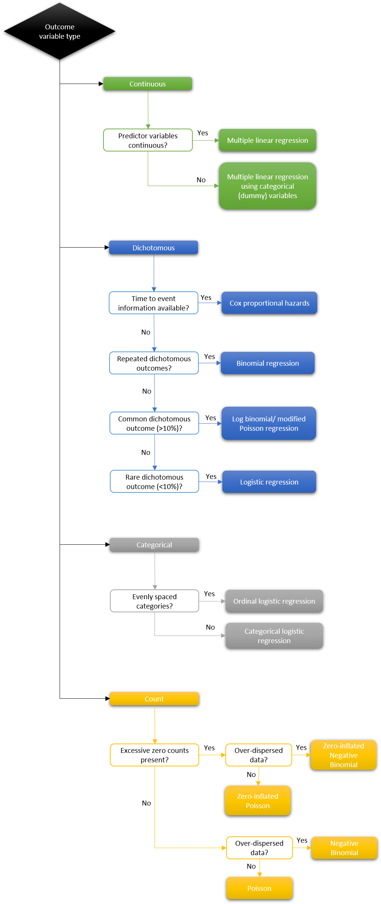
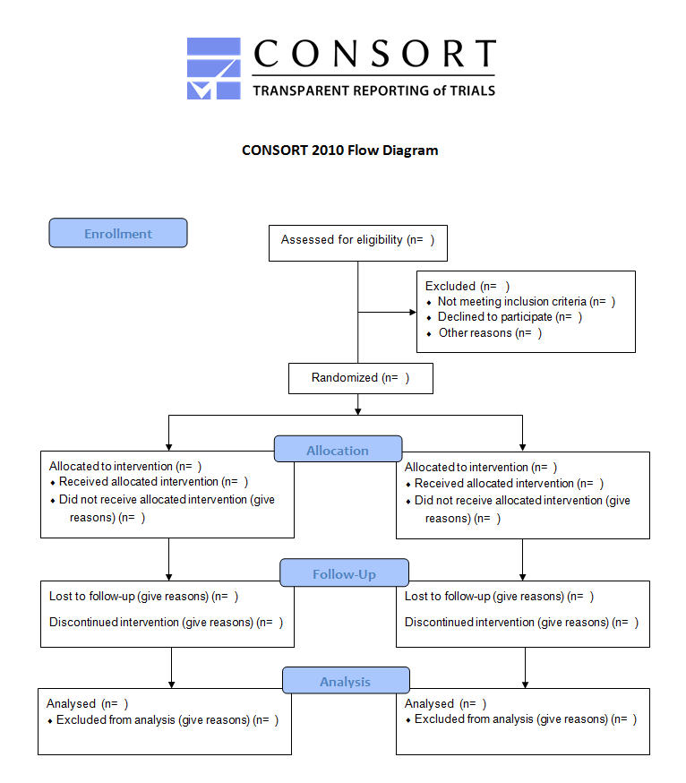

```{r setup, include=FALSE}
library(learnr)
library(Hmisc)
library(dplyr)
knitr::opts_chunk$set(echo = FALSE)
Hmisc::getHdata(acath)

acath2 = acath %>% 
  select(-choleste, -sigdz) %>% 
  filter(! is.na(tvdlm)) %>% 
  mutate(tvdlm = as.integer(tvdlm)) %>%
  mutate(sex = factor(sex, levels=c(0,1), labels = c("Male", "Female"))) %>%
  mutate(cad.dur = as.integer(cad.dur)) %>%
  mutate(age = as.integer(age))

summary(acath2)

```


{width="75%"}


## Introduction

<span class="copyright">© Copyright 2021 UNSW Sydney. All rights reserved except where otherwise stated.</span>

<br>

In statistics courses, a lot of time is spent teaching the specific detail of how to conduct different types of regression analyses with data that is perfectly designed for the analysis of interest. However, in practice during your Health Data Science career, you will likely receive messy data and be faced with the big question: which is the appropriate type of analysis? This will depend on your research question and the type of data you have. Once the appropriate model is chosen, you will commence the process of 'model building' i.e. determining which variables to include or exclude during your analysis, and in what order.

Once your analysis is complete, you begin the task of communicating the results to others. To do this you need to be able to identify the most important components of your statistical output, and present them in such a way that the reader can correctly interpret your results. Each of these tasks is a learned skill that takes practice. 

In this chapter we present an overview of some best-practice tips for conducting statistical analyses. We will cover methods for choosing the appropriate statistical model, and model building principles, including information to help you select covariates. We conclude the chapter with guidelines for presenting and reporting your results. 


## Choosing the model

As you have seen in thus far, we make a distinction about model types based on our outcome of interest (to a point, if repeat measures are involved there are other models which we haven’t covered in this course. More on these in HDAT9700 Statistical Modelling II). With that in mind, choosing a model comes down to a few additional questions. Here’s a simplified flowchart outlining the model types, based on the outcomes of interest.

{width=90%}

### Activity

For each of the research questions below, use the Regression Models flowchart to identify the correct methods of analysis. 

1. Among a group of children being treated for acute lymphoblastic leukaemia, is cranial radiation (yes/no) associated with increased BMI (standarsised) z-score?

2. Among a population of chronically-ill patients in Sydney (age 60+), does participation in a coordinated care intervention (two groups: intervention vs. usual care) reduce the number of emergency department re-presentations?

3. For people living with HIV in Vietnam, what are the demographic and clinical factors (e.g. age, sex, location, BMI) that predict time to initiation of treatment with antiretroviral therapy? 

4. Among a group of Australian men, does alcohol consumption (in units/day) predict the risk of developing the condition Barrett's Oesophagus (yes/no)?


## Model building

We have already mentioned model building in previous chapters, but let’s take some time to delve a little deeper into this topic. 

You might have heard the saying “Rome wasn’t built in a day” – and the same can be said for building a statistical model. This task varies depending on a dataset and the variables it contains, analysts’ experience and knowledge of the field. And plenty of iterations, checking, interpreting and testing. 

Now, there are automated ways of model building and selection (you may have come across [stepwise selection](https://en.wikipedia.org/wiki/Stepwise_regression) or forward and backward selection procedure). But don’t get fooled by their ease of use. The rigour and thought of manual model building cannot be replaced by the machine (unless we want to fit the best prediction model and use machine learning techniques). So you can use stepwise methods as a guide only, but you still need to make iterative decisions yourself. 

Model building is an artform, and there are no set ‘rules’ about ways of going about it. The choice of the next step is dependent on the findings of the preceding one, and there are numerous checks and tests to perform at each stage. Thus, while we can provide some guidance, the rest of the creativity comes down to you:

1)	Always, always, think about your **research question**. Keep on revisiting the purpose of your analysis and revisit why you are doing the modelling. It’s very easy to get lost in the data and start finding interesting relationships, but if they are leading you into a rabbit hole, step back, and remember your research question. 

2)	Think about the **predictors** themselves and try to group them into meaningful groups (to help guide the interpretations). Epidemiologists often use a conceptual model such as the [Anderson Healthcare Utilization Model](https://en.wikipedia.org/wiki/Andersen_healthcare_utilization_model), in which an individuals’ access to healthcare services is determined by three factors. These are:
  * Predisposing factors (individuals’ socio-cultural characteristics including demographics, social structure and health beliefs) 
  * Enabling factors (factors impacting on obtaining care)
  * Need (functional and health problems leading to the use of health services). 
  
  But you can also think in simpler structures such as:
  
  * Sociodemographic information – age, sex, school attainment, socio-economic factors
  * Health status – present chronic or acute conditions, self-rated health 
  *	Risk factors – smoking, obesity, alcohol and drug use etc
  * Etc.

  These sets of variables can help you in understanding and interpreting correlations and multicollinearity. An example of correlated variables might be patient’s geographical location of residence (e.g. Access/Remoteness Index of Australia (ARIA) – major city, inner and regional areas, remote and very remote areas) and area’s sociodemographic status (e.g. SEIFA decile – low to high disadvantage area). As the two measures are correlated, analysts usually include one or the other variable in the model, but not both simultaneously. 

3)	We stressed the importance of the **exploratory data analysis (EDA)** over and over in the course. Even if you think you may know the data well, it’s always a good idea to plot the data first and examine its characteristics. We can quickly get a sense of the distribution and any outlying observations, as well as any ambiguities in the dataset. Do not underestimate the power of descriptive statistics. 

4)	Check the association between the outcome and each individual variable (**univariate analysis**). Here we can check whether there seems to be a relationship between variables and decide on the functional form. Here we also produce plots, as they can provide invaluable information about whether linear relationships are present, or you may need to consider nonlinearity. Estimate the model coefficients and note its size and significance, we’ll use this information iteratively in the next step. 

5)	Start putting the variables that you find are significantly associated with an outcome in **multivariable model**. Here we don’t just put the variables that are significant at 5% level, but those that are significant at even 10% or 20% level. Now that you’ve put a few significant variables in the model all at once, how have the model coefficients changed in size and significance? Test the overall significance of the model and evaluate its diagnostics. 


6)	At this stage you can start **excluding non-significant variables** from the previous step, and re-fitting the multivariable model with a possibly reduced variable set. Again, examine the significance of each of the variables in the model, and their joint significance. Evaluate the diagnostics again.


7)	Check for **interactions** between variables – here we use our scientific knowledge to test for interactions which may be present. We add interactions one at the time and test its significance. If we find a significant interaction, we need to take care in interpreting the coefficients accordingly. Also, make sure that you don’t delete the component variables themselves! For example if we are testing an interaction between age and sex variables, we need to keep all three variables in the model (age, sex, age*sex) regardless of the significance of the age and sex variables themselves. The interpretation of the interaction is only possible if we have all component terms in there. 

8)	**Interpretation**! Stop and ‘listen’ to the results. What are they telling you? Do they make sense and can you interpret them? Here we move beyond statistical significance and start examining the relationships quantitatively. Bear in mind that just because something has a significant p-value that it may not hold much importance clinically. Remember to interpret the model coefficients according to which model you fit – OR, RR, HR or something else.   

See – there is ‘art’ in model building and selection. And who says that statisticians can’t be creative? 


## A worked example {data-progressive=TRUE}

This section presents a simple worked example loosely following the steps outlined in the previous section. Each subsection is progressively revealed; there are 8 subsections in all: 

* The research question  
* Getting to know the data  
* Data preparation  
* Exploratory data analysis  
* Model building  
* Refining the model  
* Model interpretation  
* Calibration  

You will need about one hour to work through these carefully. 


### The research question

Cardiac catherization is a medical procedure undertaken to diagnose cardiovascular conditions. The procedure involves inserting a narrow tube or catheter into the heart, via a blood vessel from the arm, neck or groin. Once the catheter is in place, measurements on the condition of the heart muscles, valves and vessels can be taken to identify coronary disease.

The aim of this exercise is to build a model that can usefully predict the presence of severe coronary disease using just three patient characteristics that can be easily assessed over the telephone: age, sex and duration of symptoms.     

The data for this exerice are taken from the `acath` dataset which comes with the `rms` package. More information [here](https://hbiostat.org/R/rms/). 

> This dataset is from the Duke University Cardiovascular Disease Databank and consists of 3504 patients and 6 variables. The patients were referred to Duke University Medical Center for chest pain. Severe coronary disease is defined as three-vessel or left main disease and is denoted by tvdlm=1.

The variables in the dataset are: 

`sex` (0=Male, 1=Female)  
`age` (in years)  
`cad.dur` (Duration of Symptoms of Coronary Artery Disease, e.g. chest pain)   
`choleste` (Cholesterol)  
`sigdz` (Significant Coronary Disease by Cardiac Catherization)  
`tvdlm` (Three Vessel or Left Main Disease by Cardiac Catherization)  

Two of these variables can be **ignored** for the the purposes of this exercise:  
1. `choleste` which contains a large number of missing observations (methods for handling missing data in regression analyses are covered in HDAT9700)  
2. `sigdz` which is an alternative classification of disease, also established through cardiac catherization. 


### Getting to know the data

We can read in the data as follows: 

```{r wex1, echo=TRUE, exercise=FALSE}
library("Hmisc")
getHdata(acath)
```

We will explore the data using the `head()` and `str()` functions 

```{r wex2, echo=TRUE, exercise=FALSE, exercise.lines=8}
head(acath)
```

* In the first six rows we can see some *NA* values for the variable `choleste`

***

```{r wex3, echo=TRUE, exercise=FALSE}
str(acath)

```

* The dataframe has 3,504 observations on six variables  
* The class of the variables is `labelled` which is a bit unusual

*** 

We can use `summary()` to get a quick overview of the variable distributions 

```{r wex4, echo=TRUE, exercise=FALSE, exercise.lines=8}
summary(acath)
```

* 31% of patients are female  
* The median age is 52 years (range 17-82)  
* The median duration of symptoms is 18 days (range 0-416)  
* There are 1,246 obseravtions missing for `choleste`  
* 32% of patients had severe coronary disease (`tvdlm`) 
* There are 3 missing observations for `tvdlm` 


### Data preparation
Elements of the provided data frame are not ideal for future analysis. Here we take a few steps to make an analysis-ready dataset, including:  

* Drop the variable `choleste` which is incomplete and will not be used  
* Drop the variable `sigdz` which will not be used
* Drop the 3 records with missing outcome data
* We also mutate some variables to make them easier to work with if (e.g. add value labels for sex, change storage types)

```{r wex5, echo=TRUE, exercise=FALSE, exercise.lines=12}
acath2 = acath %>% 
  select(-choleste, -sigdz) %>% 
  filter(! is.na(tvdlm)) %>% 
  mutate(tvdlm = as.integer(tvdlm)) %>%
  mutate(sex = factor(sex, levels=c(0,1), labels = c("Male", "Female"))) %>%
  mutate(cad.dur = as.integer(cad.dur)) %>%
  mutate(age = as.integer(age))

summary(acath2)

```


### Exploratory data analysis

Before modelling can begin it is essential to understand the variables, their distribution and the relationships between them. 

We've already used `summary()` to look at the univariate distribution of the four variables to be used in the analysis. Try using `histogram()` to get a better sense of the distribution of the continuous variables.

```{r wex6, exercise=TRUE, exercise.lines=12}

```

You should also examine the bivariate relationship between the predictor variables and the outcome. You could do this graphically or you could use a formal test.  

```{r wex7, exercise=TRUE, exercise.lines=12 }


```


```{r wex7-hint}

# % diseased by sex
acath2 %>% 
group_by(sex) %>% 
summarise(mean=mean(tvdlm)) %>%  
ggplot(aes(sex, mean)) + geom_col()

# % diseased by deciles of age
acath2 %>% 
mutate(age2=cut(age,unique(quantile(age, seq(0,1,by=0.1))))) %>%
group_by(age2) %>% 
summarise(mean=mean(tvdlm)) %>%  
ggplot(aes(age2, mean)) + geom_col()

# % diseased by deciles of symptom duration
acath2 %>% 
mutate(cad.dur2=cut(cad.dur, unique(quantile(acath2$cad.dur, seq(0,1,by=0.1))))) %>%
group_by(cad.dur2) %>% 
summarise(mean=mean(tvdlm)) %>%  
ggplot(aes(cad.dur2, mean)) + geom_col()

```


Check for any interactions: does the relationship between age and disease differ for males and females for example? 

```{r wex8, exercise=TRUE, exercise.lines=12 }

```

```{r wex8-hint}

# % diseased by deciles of age
acath2 %>% 
mutate(age2=cut(age,unique(quantile(age, seq(0,1,by=0.1))))) %>%
group_by(age2, sex) %>% 
summarise(mean=mean(tvdlm)) %>%  
ggplot(aes(age2, mean, fill=sex)) + geom_col(position="dodge")

# % diseased by deciles of symptom duration
acath2 %>% 
mutate(cad.dur2=cut(cad.dur,unique(quantile(cad.dur, seq(0,1,by=0.1))))) %>%
group_by(cad.dur2, sex) %>% 
summarise(mean=mean(tvdlm), count=n()) %>%  
ggplot(aes(cad.dur2, mean, fill=sex)) + geom_col(position="dodge")

```

***

Having explored the data you should be able to answer the following questions

```{r q1, echo=FALSE}
question("Men are more likely than women to have severe coronary disease. By how much?",
  answer("About 50% more likely"),
  answer("About twice as likely", correct = TRUE, message = "39% Male versus 17% Female" ),
  answer("About half as likely"),
  answer("About three times more likely"),
  allow_retry = TRUE,
  random_answer_order = TRUE
)
```


```{r q2, echo=FALSE}
question("Duration of symptoms is a better predictor of severe coronory disease for women compared to men?",
  answer("True", correct = TRUE, message = "There is a stronger relationship between duration of symptoms and disease for men"),
  answer("False"),
  answer("About the same", message="probably not"),
  allow_retry = TRUE,
  random_answer_order = TRUE
)
```

### Model building 

Now that we are more familiar with our data we can start to fit some simple models. Disease status is a binary outcome, so we will start with a logistic regression model (because the primary task here is prediction rather than explanation we won't worry for now that odds ratios from a logistic regression will overstate the risk ratio). As a baseline model, consider the model with main effects for `sex`, `age` and `cad.dur`.

```{r wex9, exercise=FALSE, echo=TRUE}
m1 <- glm(tvdlm ~ sex + age + cad.dur, family=binomial(link=logit), data=acath2)
summary(m1)
exp(coefficients(m1))

```

Above we can see that all three variables are significantly associated with the outcome and that the direction of the results are as we would expect from out exploratory analysis:  

* The odds of severe disease was lower for women    
* The odds of severe disease increases with age  
* The odds of severe disease increases with duration of symptoms 


*** 

Adapt the code above to explore interactions and non-linearities. Fit the following models:  

* m2 = m1 + `age`:`sex` interaction
* m3 = m1 + `cad.dur`:`age` interaction
* m4 = m1 + `cad.dur`:`sex` interaction
* m5 = m1 + quadratic term for `age`
* m6 = m1 + quadratic term for `cad.dur`


```{r wex10, exercise=TRUE, echo=TRUE, exercise.lines=20}
m1 <- glm(tvdlm ~ sex + age + cad.dur, family=binomial(link=logit), data=acath2)


```

```{r wex10-hint}
m1 <- glm(tvdlm ~ sex + age + cad.dur, family=binomial(link=logit), data=acath2)

m2 <- glm(tvdlm ~ sex + age + cad.dur + age:sex, family=binomial(link=logit), data=acath2)

m3 <- glm(tvdlm ~ sex + age + cad.dur + cad.dur:age, family=binomial(link=logit), data=acath2)

m4 <- glm(tvdlm ~ sex + age + cad.dur + cad.dur:sex, family=binomial(link=logit), data=acath2)

m5 <- glm(tvdlm ~ sex + age + cad.dur + I(age^2), family=binomial(link=logit), data=acath2)

m6 <- glm(tvdlm ~ sex + age + cad.dur + I(cad.dur^2), family=binomial(link=logit), data=acath2)

lapply(list(m2,m3,m4,m5,m6) , function(x) {print(anova(m1,x, test="Chisq"))} )
```

```{r q3, echo=FALSE}
question("Which of the following statements are true, based on the models above? (Select all that apply)",
  answer("There is evidence for a non-linear effect of age"),
  answer("There was a significant interaction between age and sex"),
  answer("The effect of symptom duration was linear"),
  answer("The effect of symptom duration was different for men and women", correct=TRUE),
  answer("There was a significant interaction between age and symptom duration"),
  answer("The effect of age was approximately linear", correct = TRUE),
  allow_retry = TRUE,
  random_answer_order = TRUE
)
```

```{r q4, echo=FALSE}
question("which models improved on the baseline model? (Select all that apply):",
  answer("m2"),
  answer("m3"),
  answer("m4", correct=TRUE),
  answer("m5"),
  answer("m6", correct=TRUE),
  allow_retry = TRUE,
  random_answer_order = TRUE
)
```

### Refining the model

If you have worked thorugh the previous section, you should have seen that there is evidence for a non-linear effect of symptom duration, and also evidence for an interaction between symptom duration and sex. Let's revisit the exploratory data analysis to understand what is going on between sex, symptom duration and the risk of severe disease. 

```{r wex11, exercise=FALSE, echo=FALSE}
acath2 %>% 
mutate(cad.dur2=cut(cad.dur, c(0,1,7,30, 60, 90, 120, 450))) %>%
group_by(cad.dur2, sex) %>% 
summarise(mean=mean(tvdlm), count=n()) %>%
filter(is.na(cad.dur2)==FALSE) %>%  
ggplot(aes(cad.dur2, mean)) + geom_col(aes(fill=sex)) + 
  labs(x="Durations of symptoms in days", y = "Proportion with severe coronary disease") +
  facet_grid(rows=vars(sex), margins=TRUE)

```

We can see that  

* For the whole population, the risk appears to flatten slightly after 60-90 days symptom duration  
* This is most pronounced for men   
* Among women, the relationship between severe disease and symptom duration is much flatter  


Based on these observations, let's try two more models: 

* m7 = m1 + `sex`:`cad.dur` interaction + quadratic term for `cad.dur`  
* m8 = m1 + `sex`:`cad.dur` interaction + quadratic term for `cad.dur` + age:`cad.dur`^2 interaction

The model **m7** allows for the effect of symptom duration to be non-linear, and it allows the fitted curve to vary for males and females, but the curvature must be the same. In contrast, **m8** allows the curvature for males and females to differ. 

Run the code below to fit the two additional models. Add your own code to examine the models and test if they improve on earlier ones.

```{r wex12, exercise=TRUE, exercise.lines=20}
# Assume non-linear sex-duration interation (same curvature for male and female)
m7 <- glm(tvdlm ~ age + sex + cad.dur + cad.dur:sex + I(cad.dur^2), data=acath2, family=binomial(link=logit))

# Assume non-linear sex-duration interation (different curvature for male and female)
m8 <- glm(tvdlm ~ age + sex + cad.dur + cad.dur:sex + I(cad.dur^2) + I(cad.dur^2):sex, data=acath2, family=binomial(link=logit))
```


### Model interpretation 

So far we've only had a cursory examination of the model output. Lets have a closer look at estiamted parameters from model 8 and makes sure we can interpret them ok. 

```{r wex13, exercise=FALSE, echo=TRUE}
# Assume non-linear sex-duration interation (different curvature for male and female)
m8 <- glm(tvdlm ~ age + sex + cad.dur + cad.dur:sex + I(cad.dur^2) + I(cad.dur^2):sex, data=acath2, family=binomial(link=logit))

summary(m8)
```

The intercept is -3.9 on the log odds scale. This means that for the baseline individual, the log odds of severe coronary disease is $-3.9$, the odds of severe disease is $e^{-3.9} = 0.02$ and the probability of severe disease is $(e^{-(-3.9)}+1)^{-1} = 0.02$, or 2%. This seems remarkably low. We know from our EDA that around 32% of patients in the sample have severe coronary disease. 

So who is this "baseline" patient with very low risk? The baseline patient is the observation where each of the predictors is set to zero (for continuous variables) or the baseline category (for categorical variables). For our model above, the baseline patient is a male, aged 0 with 0 days cardiac symptoms. We've prediceted the risk for a newborn baby! This is obviously not very useful, and also completely invalid, given that our sample only contained adults. Making predictions based on values which lie far outside the range of the observed data is called extrapolation and is bad practice.     
 
We can mean-centre the age variable to get more sensible predictions. This means that the baseline age will be the average age in the sample: 52 years. At the same time, lets set the baseline category for `sex` to be the low-risk group, i.e. females. In a normal analysis you would probably make these changes as part of the data cleaning but here the are done directly in the model. 

```{r wex14, exercise=FALSE, echo=TRUE}
# Assume non-linear sex-duration interation (different curvature for male and female)
m8b <- glm(tvdlm ~ I(age-52) + relevel(sex, ref = "Female") + cad.dur + cad.dur:sex + I(cad.dur^2) + I(cad.dur^2):sex, data=acath2, family=binomial(link=logit))

summary(m8b)
```

<div class="aside"> 

### Aside

Note that while these changes will make the model parameters easier to interpret, nothing has changed in a statistcal sense. We can see this if we formally compare model 8 to model 8b:

```{r wex15, exercise=FALSE, echo=TRUE}
# Assume non-linear sex-duration interation (different curvature for male and female)
m8 <- glm(tvdlm ~ age + sex + cad.dur + cad.dur:sex + I(cad.dur^2) + I(cad.dur^2):sex, data=acath2, family=binomial(link=logit))
m8b <- glm(tvdlm ~ I(age-52) + relevel(sex, ref = "Female") + cad.dur + cad.dur:sex + I(cad.dur^2) + I(cad.dur^2):sex, data=acath2, family=binomial(link=logit))

print(anova(m8,m8b,test="Chisq"))
```

</div>

**Baseline**
Returning to the interpretation of model 8b, the intercept is now -1.824. This means that for the baseline individual (a 52 year old women, with 0 days symptoms) the odds of severe disease is $e^{-1.824} = 0.16$ and the probability of severe disease is $(e^{-(-1.824)}+1)^{-1} = 0.19$, or 19%. This seems more sensible.

**Age**  
The estimated parameter for `age` is 0.0592 which means that the odds of severe disease increases be an estimated $e^{0.0592} = 1.06$ or around 6% for each additional year of age after 52 years.    

**Sex**  
The estimated parameter for `sex` is 1.0 on the log odds scale. The baseline group is female, which means that the estimated increased odds of disease for men relative to women is $e^{1.0} = 2.7$. Because the model includes other terms interacting with `sex` this estimate refers to the case when those terms are 0, i.e. when symptom duration `cad.dur` is 0 days.   

Thinking back to the EDA section, we saw that the risk of severe disease was about twice as high for men versus women. The estimated odds ratio of 2.7 is a bit higher than our intuitive sense that the risk is twice as high in men. Try adapting the code to fit a modified Poisson model instead of a logistic regression in the code block below. Recall that the modified Poisson assumes a Poisson distribution with a log link. How does the estimated risk ratio for males versus females from the modified Poisson model compare to the corresponding estimated odds from the logistic regression? Can you remember what is going on here? (See Chapter 6).

```{r wex15b, exercise=FALSE, echo=TRUE}
m8b <- glm(tvdlm ~ I(age-52) + relevel(sex, ref = "Female") + cad.dur + cad.dur:sex + I(cad.dur^2) + I(cad.dur^2):sex, data=acath2, family=binomial(link=logit))
```

**Symptom duration**
Interpreting interaction effects directly from model coefficients is difficult, but as a starting point we can use the magnitude and sign (i.e. positive or negative) of the parameter estimates to understand the shape of the fitted curve for the relationship between symptom duration, sex and risk of disease.

The main effect for symptom duration `cad.dur` is positive and the quadratic term is negative but much smaller. This suggests that the relationship between symptom duration and disease in men (the baseline group) is positive but tapers off as sypmtom duration increases.

Visualising predicted values from our model is great way to help us understand and interpret interaction estimates. Lets have a look at predicted risk for men and women by sypmtom duration. To make things simpler, we will just look at the relationship at ages 30, 40, 50, and 60 years.

```{r wex16, exercise=FALSE, echo=TRUE}
m8b <- glm(tvdlm ~ I(age-52) + relevel(sex, ref = "Female") + cad.dur + cad.dur:sex + I(cad.dur^2) + I(cad.dur^2):sex, data=acath2, family=binomial(link=logit))

acath2 %>%
  mutate(pred = predict(m8b, type="response")) %>%
  filter(age %in% c(30,40,50,60,70)) %>%
  ggplot(aes(cad.dur, pred)) + 
  geom_point(aes(col=sex)) + 
  facet_grid(rows=vars(age)) + 
  labs(y="Predicted probabilty of severe coronary disease", x = "Symptom duration in days")

```

* For men, the positive relationship between sypmtom duration and the risk of disease starts to flatten then taper off after about 150 days. This is most clearly seen in the panel for men aged 60 years; there were few individuals with symptom duration greater than 150 at other ages.  
* For women, the estimated relationship between symptom duration and risk of disease was quite flat.

***

Use the model below to predict the probability of severe disease for a 65 year old man who has been experiencing angina for seven weeks.

```{r wex17, exercise=TRUE, exercise.lines=8}
m8b <- glm(tvdlm ~ I(age-52) + sex + cad.dur + cad.dur:sex + I(cad.dur^2) + I(cad.dur^2):sex, data=acath2, family=binomial(link=logit))

```

```{r wex17-hint-1}
# Apply the predict() function to a dataframe with variables age, sex and cad.dur set to the appropriate values
```

```{r wex17-hint-2}
m8b <- glm(tvdlm ~ I(age-52) + sex + cad.dur + cad.dur:sex + I(cad.dur^2) + I(cad.dur^2):sex, data=acath2, family=binomial(link=logit))

# Fill in the blanks
pred.dat = data.frame(age=, sex=" ", cad.dur=)
predict(m8b, newdata=pred.dat, type="response")
```

```{r q5, echo=FALSE}
question("The predicted probability of severe coronary disease for a 65 year old man who has been experiencing angina for seven weeks is approximately",
  answer("54%"),
  answer("50%"),
  answer("61%", correct=TRUE),
  answer("57%"),
  allow_retry = TRUE,
  random_answer_order = TRUE
)
```

### Calibration
One way to test the calibration of the model is to check that the proportion of observed cases matches the predicted probabilities. For example, among individuals with a predicted probability of 0.50-0.60, around 55% should have severe coronary disease. The plot below shows this for 30 bins of equal size.

```{r wex18, exercise=FALSE}
m8b <- glm(tvdlm ~ I(age-52) + sex + cad.dur + cad.dur:sex + I(cad.dur^2) + I(cad.dur^2):sex, data=acath2, family=binomial(link=logit))

acath2 %>% 
  mutate(b = predict(m8b), p = predict(m8b, type="response")) %>% 
  group_by(cut(b, quantile(b, probs=seq(0,1,1/30)))) %>%
  summarise(tvdlm_bin=sum(tvdlm)/n(), predprob_bin=mean(p), n_bin=n()) %>%
  # add the standard error of the mean predicted probaility for each bin
  mutate(se_predprob_bin=sqrt(predprob_bin*(1 - predprob_bin)/n_bin)) %>%
    ggplot() + 
      geom_abline(intercept=0,slope=1, col="maroon") +
      geom_pointrange(aes(tvdlm_bin, predprob_bin,
      ymin = predprob_bin - qnorm(0.975)*se_predprob_bin,
      ymax = predprob_bin + qnorm(0.975)*se_predprob_bin)) +
      labs(x = "Observed proportion of severe coronary disease", y = "Predicted probability of severe coronary disease")
```

* The calibration here looks satisfactory.

***

The code used to create this plot is below, with some important details replaced with **XXX**. Can you fix the code?  

```{r wex19, exercise=TRUE, exercise.lines=TRUE, exercise.lines=20}
m8b <- glm(tvdlm ~ I(age-52) + sex + cad.dur + cad.dur:sex + I(cad.dur^2) + I(cad.dur^2):sex, data=acath2, family=binomial(link=logit))

acath2 %>% 
  mutate(b = predict(XXX), p = predict(XXX, type="XXX")) %>% 
  group_by(cut(b, quantile(b, probs=seq(0,1,1/XXX)))) %>%
  summarise(tvdlm_bin=sum(tvdlm)/n(), predprob_bin=mean(p), n_bin=n()) %>%
  # add the standard error of the mean predicted probaility for each bin
  mutate(se_predprob_bin=sqrt(predprob_bin*(1 - predprob_bin)/XXX)) %>%
    ggplot() + 
      geom_abline(intercept=0,slope=1, col="maroon") +
      geom_pointrange(aes(tvdlm_bin, predprob_bin,
      ymin = predprob_bin - qnorm(XXX)*se_predprob_bin,
      ymax = predprob_bin + qnorm(XXX)*se_predprob_bin)) +
      labs(x = "Observed proportion of severe coronary disease", y = "Predicted probability of severe coronary disease")
```

*** 


## Presenting results

Thoughout this course you have learned many techniques for modelling health data. These new analytical skills are redundant, however, if you can not effectively communicate the results of your analyses to others. Presentation of results is unfortunately often overlooked, especially when students first start learning statistical methods, when the focus tends to be on models and software rather than interpretation and communication.  

When reporting results from regression analyses we would usually include:

* Unadjusted and adjusted model coefficients for the variables of interest (present the raw coefficients or transformed to odds/risk/hazard ratios as appropriate)
* Standard errors and/or confidence intervals for the coefficient estimates
* The numbers of observations in the model
* Summary of variables adjusted for (if they are not already in the results table)
* Some measure of goodness-of-fit e.g. $R^2$, AIC as appropriate

It should go without saying that for any formal research it is insufficient to simply present the output from a statistical package; the analyst is also responsible for providing a clear summary and interpretation of the results. Effective communication extends to motivating and stating the aims of the analysis, and describing the data sources and statistical methods used so the analysis can be reproduced.   

Fortunately, there are several published guidelines available for different types of studies that provide a minimum set of items that should be reported when presenting an analysis. These guidelines include the CONSORT Statement for Randomised Trials and the STROBE Statement for observational studies.

The [Equator Network](http://www.equator-network.org/) provides a comprehensive, searchable database of over 400 reporting guidelines. Note that many of these guidelines are adapatations of standards such as the CONSORT or STROBE Statements tailored to specific methodologies and contexts. 

***

#### CONSORT Statement
_**C**onsolidated **S**tandards of **R**eporting **T**rials_

The CONSORT Statement was developed by the CONSORT Group to alleviate the problems arising from inadequate reporting of randomized controlled trials. The Statement comprises a 25-item checklist as well as a flow diagram template to illustrate how patients were included or excluded from the study. An example of the CONSORT flow diagram template is shown below. You can download the full checklist [here](http://www.consort-statement.org/consort-2010) and review an example of a study reported according CONSORT guidelines [here](http://www.consort-statement.org/examples/sample).
 


***

#### STROBE Statement
_**ST**rengthening the **R**eporting of **OB**servational studies in **E**pidemiology (STROBE)_

The STROBE statement is a detailed checklist of items that should be reported when presenting results from an observational study. Instructions cover the title and abstract, introduction, methods, results, discussion and funding. These guidelines have been developed by an interdisciplinary collaboration of statisticians, epidemiologists, researchers and journal editors. You can download the STROBE Statement for **cohort studies**, **case-control studies** and **cross-sectional studies** [here](https://www.strobe-statement.org/index.php?id=available-checklists). 

The RECORD Statment (_**RE**porting of studies **C**onducted using **O**bservational **R**outinely-collected health **D**ata_) is an extension of the STROBE Statement for studies using routinely collected health data. You can download the RECORD Statement [here](http://www.record-statement.org/checklist.php). 

*** 

### Exercise

One of the best ways to learn how to present results is to read high-qualty journal publications. As an exercise, read through the published journal article linked below. As you read the paper, compare the presented results to the corresponding publication guidelines and assess whether each checklist item has been reported adequately in the study. For this exercise, just focus on the checklist items specific to the results section, i.e. items 13-17. 

The paper for this exercise is [_Preterm Birth and Mortality and Morbidity: A Population-Based Quasi-experimental Study_](https://jamanetwork.com/journals/jamapsychiatry/fullarticle/1743009) published in 2013 in the Journal of the American Medical Association (JAMA) Psychiatry. 

This paper examines the association between gestational age and offspring mortality, and psychiatric, academic and social outcomes in later life. The authors compare siblings born at different gestational ages in an attempt to isolate the causal effect of gestational age from other background confounding factors (factors which could simultaneously increase the risk of early gestational age and adverse outcomes).   

As an observational cohort study using Swedish registry data, the [RECORD Statement](http://www.record-statement.org/checklist.php) is a suitable reporting guideline.     

***

To get you started, item 13(a) of the RECORD Statement is:  

* **Report the numbers of individuals at each stage of the study**

In the Methods section, we find the following paragraph that satisfies this requirement:  

> _The present study consisted of singleton offspring born in Sweden between January 1, 1973, and December 31, 2008. Birth-related data for 3,619,712 offspring were obtained from the Swedish Medical Birth Registry. We sequentially removed multiple births (86,273), children with missing data on GA (8290), those with a recorded GA less than 23 weeks (153) or more than 42 weeks and 6 days (41,440), missing maternal identification numbers (4070), invalid or missing sex (2), invalid parity (23), and those who emigrated from Sweden (178,753) during this period. The resulting cohort of 3,300,708 offspring represents 91.2% of all recorded births to a total of 1,736,735 biological mothers. Most offspring had siblings in the data set (2,665,666 [80.8%]); they were in families of mothers (1,101,693) with more than one offspring. Sibling comparisons were made among this subset of the population._


## Q & A

There will be a rolling Q&A on OpenLearning while this chapter is running, so please post any questions you have about the course or statistical modelling. Feel free to answer your classmates questions!  

Congratulations on reaching the end of the last chapter and good luck for the final assessment!

***

We'll leave with a final thought on model fitting from the inimitable XKCD


